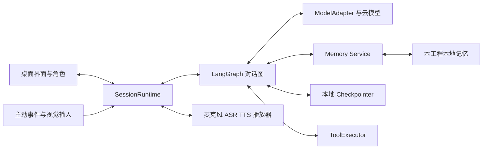
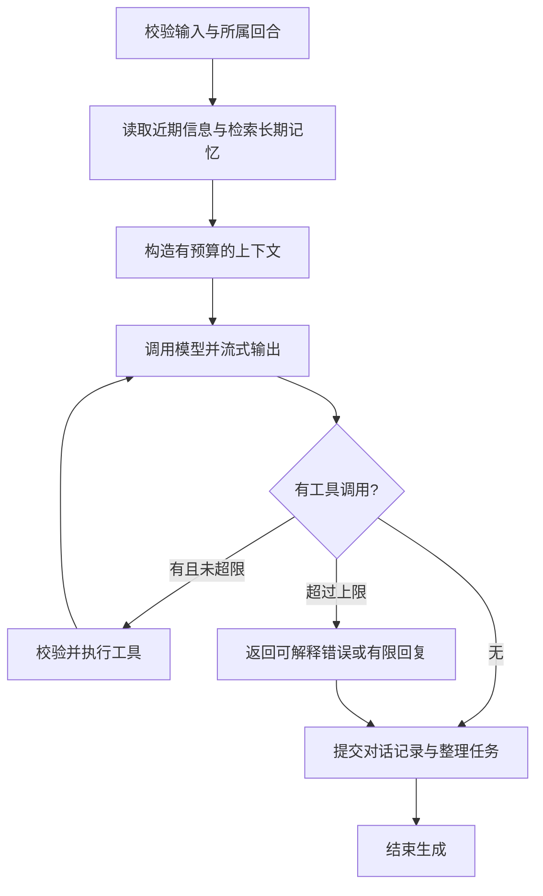

# 架构与接口设计

状态：整体设计基线；M0 已实现路径、最小连接服务与合成持久图，见 [M0 开发说明](M0-QUICKSTART.md)。完整聊天、长期记忆、媒体与桌面仍未实现。产品范围与阶段状态由 [PLAN](PLAN.md) 管理。

完整模块图解见 [20 张图与覆盖表](DIAGRAMS.md)，可 [离线查看图册](diagrams/index.html)。建议先读 01 总览、02 回合时序，再按各模块深入；图与下面的接口均是待实现设计。

## 1. 职责划分



LangGraph 决定上下文、模型调用、工具分支和回合完成。SessionRuntime 负责连接、任务归属、串行化同一会话输入、取消与媒体生命周期。Memory Service 决定长期数据的写入、检索、整理、修正与遗忘。三者都不另启动一套完整聊天循环。

N.E.K.O 的 LLMSessionManager 混合了以上职责，提取时按接口拆开；不得只在原 manager 内再套一个能够自行聊天/检索/调用工具的 LangGraph agent。主仓库中的自有 ChatOpenAI 也不能按 LangChain 客户端直接假定兼容。

## 2. 对话图

拟定流程：



记忆整理任务在提交原文与任务记录后由本工程 worker 消费；抽取/反思可以用独立维护图，但不向用户发起第二条对话。生成结束、记忆记录提交、音频流结束、播放器结束是不同事件；UI 不用一个 done 标记混为一谈。

同一 `(user_id, character_id, thread_id)` 的新输入由 Runtime 排队或抢占。每次运行分配 `turn_id`，取消先使旧轮失效。LangGraph 的 thread_id 用于恢复同一会话；user_id 和 character_id 决定长期记忆范围，不能只靠用户提供的 thread_id 判定范围。

后端从受信任的本机身份与角色配置解析 scope，为会话分配 `internal_thread_id`，持久映射到所属用户、角色和外部会话 ID；只有这个内部 ID 传给 LangGraph 的 `configurable.thread_id`。所有 get/history/run/resume/delete 入口先查映射并校验所有者，拒绝用任意外部 ID 直读 checkpoint。不同角色即使提供相同外部 thread_id，也得到不同内部 ID；范围校验不依赖模型判断。

## 3. 拟定接口契约

以下为本项目设计名，不表示 N.E.K.O 已有同名可直接导入接口。

| 边界 | 输入/方法 | 输出与约束 |
| --- | --- | --- |
| Runtime → Graph | `run_turn(user_id, character_id, thread_id, turn_id, input)` | 可取消异步运行；同一会话只有一个当前 turn |
| Graph → ModelAdapter | `stream(messages, tools, task_config, turn_id)` | 统一文字片段、工具请求、usage、错误；不在 adapter 内另写完整 agent loop |
| Graph → Memory | `retrieve(scope, query, time_range, budget)` | 内容、source_id、有效状态、时间、memory_revision；按范围过滤后才排序 |
| Graph → Memory | `commit_turn(turn_id, source_messages, delivery_state)` | 幂等保存原文及待整理任务；可区分完整、部分投递和已取消内容 |
| 设置页 → Memory | `correct / forget / inspect` | 更新有效版本与删除标记；对派生记录、索引、checkpoint 副本和在途任务生效 |
| Graph → ToolExecutor | `execute(tool_call_id, args, context, operation_id)` | 校验后的结果/错误、幂等状态；工具返回值作为资料，不成为系统指令 |
| Runtime → Media | `start / cancel(turn_id) / dispose` | 清队列、停播放器、释放设备；所有回执带所属轮次 |
| 后端 → UI | `text_delta / audio_chunk / emotion / generation_done / playback_done / turn_cancelled / error` | 公共信封：protocol_version、character_id、thread_id、turn_id、event_id、seq、payload |

前端复用通过显式事件适配器兼容已有字段；字段映射、完成语义和异常行为在 M1/M3 落地。回连后不直接重播已确认的声音；TTS 分段也必须保留 turn_id。精确重连/回执协议由 M1 测试确定。

## 4. 两种持久化，单一长期记忆权威

- `checkpoints/graph.sqlite`：拟保存 LangGraph 会话消息、节点状态和执行位置。采用文件持久适配器，不能使用 InMemorySaver 冒充重启持久化。
- `memory/`：本工程 Memory Service 的权威数据。优先移植 N.E.K.O 原始日志 SQLite 与 recent/facts/reflections/persona 等必要结构；在 M0/M2 确认实际文件布局并写迁移版本，不强行把成熟结构全部重写成单表。
- LangGraph 节点调用 MemoryServiceAdapter；若使用 Store 接口，只把它适配到同一服务，不额外建立独立事实库。索引是可重建派生物，不成为事实权威。
- GraphState 中只保留当前所需的有限上下文、来源 ID、记忆版本和必要状态；不把完整长期记忆、音频或截图原始二进制塞进每个 checkpoint。
- 正常结束时可存完整回复；打断时按已显示/实际投递状态保存部分内容，不能把从未给用户的完整草稿当已发生对话。
- 取消结算由 SessionRuntime 的独立收尾路径负责，不能依赖可能不再运行的图末节点。Runtime 接受输入时先持久登记回合与待结算记录；正常图末节点和取消 `finally` 共用 `finalize_turn(internal_thread_id, turn_id)` 幂等键。收尾事务不受旧生成任务取消连带中止，并有超时；进程崩溃或超时后由持久任务恢复结算。终态提交使用受控状态迁移，不能覆盖另一回合，也不能把已完成回合重新登记为未完成。
- 投递记录区分已发送、界面确认和实际播放位置；取消结算只保存有证据的部分并注明未确认范围。正常提交与取消并发时按同一回合记录合并、去重，而不是追加两条对话。M1/M4 分别在提交前、提交中和提交后注入取消，覆盖重启恢复。
- 删除/纠正后提高 memory_revision；恢复旧 checkpoint 时重新校验并重建上下文。清除旧副本、删除标记和在途任务防回写必须在 M2 联合验收。
- worker 从持久任务记录消费，按稳定 source_id/job_id 幂等提交。异常退出后可重试；不默认承诺任意外部工具恰好执行一次。

## 5. 图暂停与语音打断

LangGraph `interrupt()` 表示等待外部输入后恢复流程。语音插话属于 Runtime/Media 的实时控制：先停止音频并使旧 turn_id 失效，再取消图/模型任务和处理设备收尾。消费者继续拒收旧片段，避免“取消已成功但缓存音频仍在播放”。

首次语音采用 ASR → 文本图 → TTS，复用 N.E.K.O 语音模块时保留必要协议与状态处理。原生实时语音模型涉及独立输入/输出事件协议，作为后续 ModelAdapter 扩展，仍保持统一回合归属。

## 6. 设计取舍记录

| 决策 | 采用 | 对比方案与代价 |
| --- | --- | --- |
| ADR-001 对话编排 | LangGraph（用户已选） | 自写状态机依赖较少；当前选择增加框架概念与版本维护，但把图状态和条件分支显式化 |
| ADR-002 记忆 | 独立 Memory Service，优先移植 N.E.K.O 必要模块 | 把全部事实放 checkpoint 实现短，但跨会话、纠正和遗忘边界不合适；服务需额外契约测试 |
| ADR-003 复用方式 | 有来源清单的选择性移植/适配 | 全量嵌入 N.E.K.O 运行时会引入第二套编排、默认路径和服务；只读参考不会自动成为可用功能 |
| ADR-004 桌面 | 原桌面壳可复用则复用；否则最小 Electron 宿主承载可复用 Web 组件 | 全新重写交互成本大；原版安装包直接换后端未经验证，不能作为默认路线 |
| ADR-005 本机存储 | 首个原型使用本地文件和 SQLite，分清 checkpoint 与长期记忆 | 本机 PostgreSQL 可扩展但增加安装负担；SQLite 的并发/迁移/恢复需要 Windows 发行前实测 |

这些是设计选择，性能好坏要靠同场景测量。初始化阶段不安装 LangSmith 托管服务或额外服务器；模型端点独立配置。

## 7. 未来代码布局

以下目录在实现阶段按需要创建；目前已创建 app、config、graph，实际启动命令见 M0 开发说明，其余仍为规划：

```text
src/ai_neko/
  app/                 本机 API 与进程生命周期
  graph/               State、节点、路由和执行
  runtime/             回合、取消和事件
  adapters/            N.E.K.O 边界与模型协议
  memory/              持久记忆和整理任务
  media/               ASR、TTS、播放器适配
  tools/               工具定义及执行
  config/              独立路径与配置
desktop/               桌面宿主
frontend/              复用/适配后的 Web 界面与角色
tests/                 单元、集成、合成与 Windows 用例
```

## 8. 官方依据

于 2026-09-25 读取以下官方文档。下面是能力依据，具体 API 由 M0 锁定版本后验证；不是已运行示例。

- [Persistence](https://docs.langchain.com/oss/python/langgraph/persistence)：会话 checkpoint 与跨会话 Store 分工；内存适配器重启丢失。
- [Checkpointers](https://docs.langchain.com/oss/python/langgraph/checkpointers)：执行状态持久化、恢复与实现选择。
- [Streaming](https://docs.langchain.com/oss/python/langgraph/streaming)：节点/模型事件及自定义流；复用自有 SDK 时需要接事件桥。
- [Interrupts](https://docs.langchain.com/oss/python/langgraph/interrupts)：等待外部输入及恢复；恢复可能重新执行节点前面的代码，副作用需幂等。

旧 durable-execution 文档地址当前跳转到 Persistence，本计划使用实际可读的规范地址。
