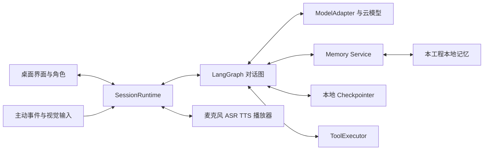
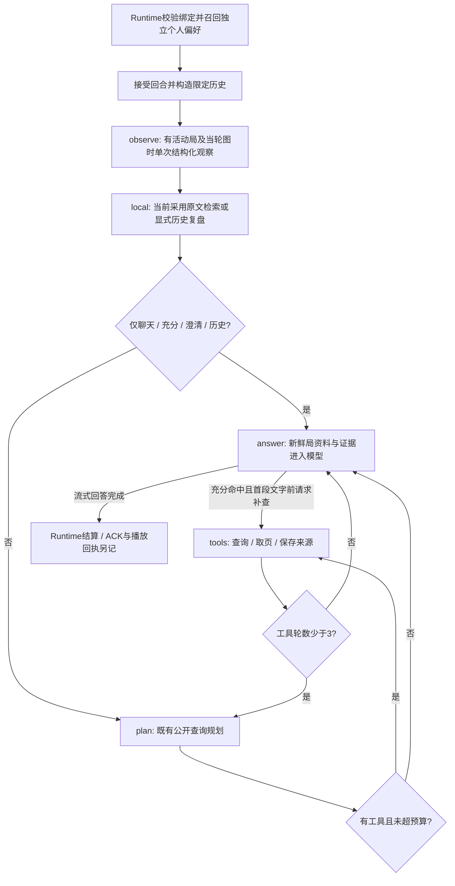

# 架构与接口设计

状态：整体设计基线与当前接口映射。桌宠宿主、单猫娘、文字/查询、人格、当轮视觉、ASR/TTS和本地长期记忆的既有证据见[五项能力实施](COMPANION-IMPLEMENTATION.md)。当前工作区已实现攻略文档、固定版本采用、本地优先检索、Runtime持久对局及G5桌宠/语音入口，历史实现见[G2报告](MVP2-G2-REPORT.md)、[G3报告](MVP2-G3-REPORT.md)与[G4报告](MVP2-G4-REPORT.md)，G5契约见下文。G6联合评测交付仍待完成；v0.4的Windows Server打包证据不替代当前工作区Windows构建、真实服务或Windows11真机验收。产品范围和阶段状态由[PLAN](PLAN.md)及[MVP2计划](NEXT-GUIDE-COMPANION.md)管理。

完整模块图解见 [20 张图与覆盖表](DIAGRAMS.md)，可 [离线查看图册](diagrams/index.html)。建议先读 01 总览、02 回合时序，再按各模块深入；图与下文描述整体目标设计，已实现映射见第 9 节，新增桌宠规划见第 10 节。

## 1. 职责划分


```mermaid
flowchart LR
    UI[桌面界面与角色] <--> RT[SessionRuntime]
    RT <--> G[LangGraph 对话图]
    G <--> LLM[ModelAdapter 与云模型]
    G <--> MEM[Memory Service]
    MEM <--> DISK[本工程本地记忆]
    G <--> CP[本地 Checkpointer]
    G <--> TOOLS[ToolExecutor]
    RT <--> MEDIA[麦克风 ASR TTS 播放器]
    P[主动事件与视觉输入] --> RT
```

LangGraph 决定上下文、模型调用、工具分支和回合完成。SessionRuntime 负责连接、任务归属、串行化同一会话输入、取消与媒体生命周期。Memory Service 决定长期数据的写入、检索、整理、修正与遗忘。三者都不另启动一套完整聊天循环。

N.E.K.O 的 LLMSessionManager 混合了以上职责，提取时按接口拆开；不得只在原 manager 内再套一个能够自行聊天/检索/调用工具的 LangGraph agent。主仓库中的自有 ChatOpenAI 也不能按 LangChain 客户端直接假定兼容。

## 2. 对话图

> **唯一对话图：`ai_neko.chat.graph`**（由 `SessionRuntime` 驱动）。`ai_neko.graph` 是 M0 合成原型，仅服务 `self-check`、`graph` CLI 与 Windows 打包冒烟的跨进程 checkpoint/scope 证据，不承载任何产品对话逻辑；新增能力一律进 `ai_neko.chat.graph`。

当前产品流程（可选观察也在同一图内）：


```mermaid
flowchart TD
    A[Runtime校验绑定并召回独立个人偏好] --> B[接受回合并构造限定历史]
    B --> C[observe: 有活动局及当轮图时单次结构化观察]
    C --> L[local: 当前采用原文检索或显式历史复盘]
    L --> E{仅聊天 / 充分 / 澄清 / 历史?}
    E -->|是| D[answer: 新鲜局资料与证据进入模型]
    E -->|否| P[plan: 既有公开查询规划]
    P --> F{有工具且未超预算?}
    F -->|是| T[tools: 查询 / 取页 / 保存来源]
    T --> Q{工具轮数少于3?}
    Q -->|是| P
    Q -->|否| D
    F -->|否| D
    D -->|充分命中且首段文字前请求补查| T
    D -->|流式回答完成| G[Runtime结算 / ACK与播放回执另记]
```

公开查询仍最多3轮、每轮3次；可选观察只调用同一model一次，不注册搜索或其他副作用工具，也不占公开查询轮数。无活动局或无本轮图时不增加模型请求。记忆整理任务由本工程worker消费，局内和显式复盘回合不自动抽取个人事实；独立维护任务不发起第二条对话。生成结束、记忆提交、音频流结束、播放器结束是不同事件，UI不能用一个done标记混为一谈。

同一 `(user_id, character_id, thread_id)` 的新输入由 Runtime 排队或抢占。每次运行分配 `turn_id`，取消先使旧轮失效。LangGraph 的 thread_id 用于恢复同一会话；user_id 和 character_id 决定长期记忆范围，不能只靠用户提供的 thread_id 判定范围。

后端从受信任的本机身份与角色配置解析 scope，为会话分配 `internal_thread_id`，持久映射到所属用户、角色和外部会话 ID；只有这个内部 ID 传给 LangGraph 的 `configurable.thread_id`。所有 get/history/run/resume/delete 入口先查映射并校验所有者，拒绝用任意外部 ID 直读 checkpoint。不同角色即使提供相同外部 thread_id，也得到不同内部 ID；范围校验不依赖模型判断。

## 3. 拟定接口契约

以下为本项目设计名，不表示 N.E.K.O 已有同名可直接导入接口。

| 边界 | 输入/方法 | 输出与约束 |
| --- | --- | --- |
| Runtime → Graph | `run_turn(user_id, character_id, thread_id, turn_id, input)` | 可取消异步运行；同一会话只有一个当前 turn |
| Graph → ModelAdapter | `stream(messages, tools, task_config, turn_id)` | 统一文字片段、工具请求、usage、错误；不在 adapter 内另写完整 agent loop |
| Graph → Memory | `retrieve(scope, query, time_range, budget)` | 内容、source_id、有效状态、时间、memory_revision；按范围过滤后才排序 |
| Graph → Memory | `commit_turn(turn_id, source_messages, delivery_state)` | 幂等保存原文及待整理任务；可区分完整、部分投递和已取消内容 |
| 设置页 → Memory | `correct / forget / inspect` | 更新有效版本与删除标记；对派生记录、索引、checkpoint 副本和在途任务生效 |
| Graph → ToolExecutor | `execute(tool_call_id, args, context, operation_id)` | 校验后的结果/错误、幂等状态；工具返回值作为资料，不成为系统指令 |
| Runtime → Media | `start / cancel(turn_id) / dispose` | 清队列、停播放器、释放设备；所有回执带所属轮次 |
| 后端 → UI | `text_delta / audio_chunk / emotion / generation_done / playback_done / turn_cancelled / error` | 公共信封：protocol_version、character_id、thread_id、turn_id、event_id、seq、payload |

前端复用通过显式事件适配器兼容已有字段；字段映射、完成语义和异常行为在 M1/M3 落地。回连后不直接重播已确认的声音；TTS 分段也必须保留 turn_id。精确重连/回执协议由 M1 测试确定。

### M1 公开资料查询接口（基础已实现，桌宠呈现待接入）

首版工具集合是只读 `search_web` 和 `read_web_page`，用于查攻略及一般资料。由现有 LangGraph 决定查询和整理步骤，ToolExecutor 负责执行；供应商 adapter 不建立第二个搜索 agent。模型 API 与搜索服务各自配置，网络请求只发送必要查询与选定公开页面，不自动上传完整记忆。

搜索工具属于应用公共能力：搜索服务配置一次，兼容的对话模型共用。当前后端为Tavily，后续新增搜索服务只在工具层增加后端适配与规范化来源，不按对话模型复制搜索实现。供应商原生搜索可作为可选后端；模型函数调用和流式协议差异由ModelAdapter负责，不能把“搜索可复用”误写成所有模型协议已经兼容。

G6测量通过`ModelAdapter(..., request_usage=True)`显式请求`stream_options.include_usage`，普通调用默认不增加该兼容要求。usage事件在流完整结束后发送，允许最后数据块的choices为空；重复用量快照取最后值，不逐块累加。只接受有界非负整数计数及已知缓存/推理细项，异常或缺失用量保持未知，不估算账单，不为不支持usage的供应商自动重试。`scripts/measure_guides.py`在独立临时根运行实际LangGraph/Runtime，冷轮实际搜索/取页后采用已保存资料，再用新session问同题；记录模型/工具适配器尝试及后端文字投递，不能替代桌面显示、实际听到语音或供应商账单。人工验收及真实记录步骤见[MVP2真实验收记录](MVP2-LIVE-ACCEPTANCE.md)。

| 工具/输出 | 契约 |
| --- | --- |
| `search_web(query, locale, budget)` | 返回 `source_id/title/url/snippet`，有依据时附发布日期与版本信息；snippet 明确是搜索摘要，不表示正文已读取 |
| `read_web_page(url, budget)` | 返回规范/最终 URL、title、正文/段落、retrieved_at、access_status；published_at/updated_at/version 未提供时为 null，不以抓取时间代替 |
| 图 → 最终回答 | 需要时澄清主题、游戏/软件版本、平台及目标；将实际读取段落与关键步骤关联，保留可点击来源和冲突/缺失说明 |
| ToolExecutor → Runtime/UI | 结果带 tool_call_id、turn_id 和结构化状态；无命中、正文不可读、超时/限流、取消分别展示，不把失败当作成功搜索 |

取页只面向公开 HTTP(S)，不接入个人浏览器配置/Cookie或键鼠点击。解析后的地址必须是公开地址，重定向重新校验，拒绝本机/内网/元数据服务/文件协议；响应大小、耗时和工具总调用预算受限。网页里的指令不改变权限、scope 或工具注册表。无法访问的页面只保留访问状态，不伪称读过全文。

**键鼠自动操作、电脑控制、接管游戏或其他软件目前不实现，也不注册相应工具。** M5 可把用户主动提供的截图带入同一查询流程，正常桌宠拖拽/本应用按钮属于用户界面交互。未来外部副作用工具需要用户提出后另行规划，当前不为它们引入执行框架。

### MVP2 G1 公开正文入库（2026-09-27 实施）

`MemoryService.guides` 拥有 `guides/guides.sqlite` 的连接与生命周期。该库独立于个人事实库和其快照；网页不能触发个人记忆写入、角色更新或采用动作。文档身份按受信任scope及规范化原URL区分，查询参数保留；相同正文SHA-256复用同一文档下的不可变版本，不合并不同来源。`guide_revision_checks` 单独记录最后成功核查时间，不将核查时间当内容日期或游戏版本依据。

产品路径是 `WebTools.read → LangGraph.execute_tools → Runtime._ingest_guide_source → MemoryService.guides.ingest`。公开读取保持既有地址校验、逐跳固定IP、响应大小和超时边界；正文最多保留50,000字符，然后在图的6,000字符预算与回答节点4,000字符预算前完成保存。数据库保存失败时仍可用当轮已读片段回答，来源明确 `storage.saved=false`，不宣称已采用。

| G1 内部接口 / 数据 | 实际契约 |
| --- | --- |
| `GuideStore.ingest(source, *, game, platform, mode, game_version, version_basis)` | 只接收成功读到的公开正文，身份与游戏条件由调用方明确提供；网页不自行决定这些字段。Runtime自动缓存暂不推定游戏条件/版本 |
| `list_documents / get_document / chunks / rebuild_index` | 固定scope，稳定guide/revision/chunk ID；段落含正文字符起止和标题层级；重建不改变源版本或段落身份 |
| reader source | `original_url / final_url / url`、`retrieved_at / content_date`、`etag / last_modified`、`headings`精确字符范围、保留/提取字符数 |
| 完整性 | `full`仅指这次提取的可读文字没有已知缺失；图片/嵌入媒体未读、解码替换或超过50,000字符标`partial`并列出原因；受限页/登录页/空页不入库 |
| `source`事件 | 保留原本S编号/6,000字符片段，新增`completeness / completeness_reasons / prompt_truncated / original_url`；`storage`仅有保存结果、稳定ID、内容摘要、去重及完整性，无整篇正文 |
| 容量 | 默认100MiB逻辑UTF-8载荷预算，包含正文、元数据与段落副本；SQLite页/日志额外占用另计。仅回收本scope未保护文档，无法回收则整次写入回滚；G2采用关系必须在确认前持久保护 |
| 取消/关闭 | 入库在线程执行且由Runtime追踪到真实结算；迟到抓取不开始写入。已开始的自动缓存写入可完成，但取消后不显示新来源或调用回答模型。工作线程失败不能覆盖原取消信号 |

攻略库从事务迁移v2创建，拒绝未来schema，成功初始化移除临时迁移备份；个人记忆快照既不包含也不替换攻略库。后续G2管理、G3检索与G4对局的实现边界见各自小节，不从G1入库能力推断其他关卡结果。

### MVP2 G2 采用与管理（2026-09-27 实施）

G2将攻略库迁移至v3、对话库迁移至v4；具体结果与边界见[G2报告](MVP2-G2-REPORT.md)。`GuideStore`持有控制修订和固定正文版本采用关系，`GuideRuntimeMixin`管理异步操作、依赖失效与可续清意图；没有新增模型或工具循环。刷新只更新文档最新版本指针，采用关系保留原`revision_id`，再次明确采用才改变。

| 鉴权路由 | 契约 |
| --- | --- |
| `GET /api/guides`、`GET /api/guides/{guide_id}` | 固定scope列表及详情，详情可指定单个`revision_id`；返回当前控制修订 |
| `POST /api/guides`、`POST /api/guides/{guide_id}/refresh` | 两者均要求`request_id + expected_revision`；导入必填公开URL，游戏/平台/模式和版本依据可选；刷新仅接受两控制字段，不继承旧版本的游戏版本断言。返回202操作回执，最多4个活动抓取 |
| `GET /api/guide-operations/{request_id}`、`POST .../cancel` | 状态为running/completed/error/cancelled/interrupted；预取消拒绝后到创建，重试不重复取页；已开始保存时取消等真实结算 |
| `PUT /api/guide-selection` | `game/platform/mode`与固定`guide_id/revision_id`；两ID同时为null表示取消采用。采用、删除、恢复要求`expected_revision`和32位十六进制`request_id` |
| `DELETE /api/guides/{guide_id}` | 显式`confirm=true`；持久删除标记与清理意图，删除正文及其助手证据副本，保留无关用户原话/个人事实 |
| `GET/POST /api/guide-backups`、`POST /api/guide-backups/{backup_id}/restore`、`DELETE /api/guide-backups/{backup_id}` | 独立格式、固定文件ID，不接受任意路径。备份有幂等request_id，恢复还要求预期修订和确认；不恢复个人记忆 |

请求先验证身份，再检查64KiB上限、字段白名单和类型；不接受scope、用户/角色身份或客户端正文。控制账本仅保存安全ID/数值/状态。旧控制回执可重放但标明当前修订及是否已被后续操作取代；不恢复旧绑定。桌面IPC只放行上述精确路径。

实际读到的来源在注入前记`turn_guide_sources`地址/正文哈希，即使入库失败也可关联清理；成功入库另记`turn_guides`具体版本。后续依赖沿实际送给模型的助手历史传播；显式历史复盘也保留旧攻略依赖，供后续删除清理。切换使旧依赖退出当前决策，删除/恢复清除相关事件与checkpoint；不以助手的攻略依赖作为用户个人事实来源去执行遗忘。攻略控制仍保守结算活动回合与语音任务，并同步G4当前局的采用关系；G5客户端先停止实际播放器、队列与录音，再提交控制。

`guide_backup_registry`在写快照之前持久登记scope归属，已登记坏文件可在删除时安全清理。合法旧快照可验证后登记；完全未知归属的损坏外来文件保持明确人工恢复边界。删除/恢复只有副本清理成功后才移除跨库意图；进程重启可从已提交结果继续，不依赖已经删除的快照文件。

### MVP2 G3 本地优先检索（2026-09-28 实施）

`GuideRetriever`从同一`GuideStore`读取固定采用版本，先过滤scope、游戏/平台/模式和已知版本，再使用已有分词器及BM25排序。最多6段、8,000字符，来源保留guide/revision/chunk ID和原文字符位置；覆盖不足不会拿首段补位。结果分为`sufficient / gap / needs_check / clarify`；未知版本不因304核查成功变成适用版本。多份采用而没有当前游戏条件时明确澄清，不跨游戏混合检索。

唯一对话图在可选`observe`后运行`local`节点：资料足够则直接调用回答模型，联网模式中的缺口或需核查进入既有规划，澄清直接回答。仅聊天模式也可读取本地采用资料。`LazyWebTools`直到真实需要工具才建立适配器，因此没有搜索Key的本地命中仍可回答。实际片段在来源事件和模型请求之前登记`turn_guides`及来源哈希，切换/删除沿用控制修订门禁；来源S编号每轮独立，网页的新内容不会覆盖已采用旧片段。

按需联网模式下，本地命中的第一次回答调用可在输出文字前提出补查，回到同一图的原工具预算；不增加第二个agent循环。首个可见文字一旦到达就立即流式投递，随后到达的工具调用延后到下一轮，避免为了补查而整段缓冲、拖延TTS。模型输入明确区分本地资料、当前核查状态和搜索摘要。

| G3 边界 | 实际契约 |
| --- | --- |
| 24小时/明确最新 | 用户回合中核查采用资料，没有自动后台联网；只对曾读取的同一最终URL发送ETag/Last-Modified，每个重定向仍校验公开地址，整个取页有总时限 |
| 304 / 新正文 / 失败 | 304只更新核查时间；新正文另存版本，不继承旧游戏版本断言、不暗换采用；失败保留旧资料并标需核查，内容日期和游戏版本不以抓取日期填充 |
| 搜索缓存 | 120秒、最多64项，键包含scope、配置代次、查询与locale，仅缓存成功搜索摘要；同键合并等待者，单人取消不影响其他人，最后取消等待真实请求结算 |
| 缓存撤销 | 配置/凭据变更、攻略控制变更、续清意图恢复撤销在途和已缓存结果；显式最新即使尚未采用资料也绕缓存，迟到旧请求不能覆盖新结果 |
| 来源卡 | 本地已采用正文、原文版本、最后核查时间及原文位置明确显示；缓存搜索摘要标记复用，不能显示为本轮重新联网 |
| 测量 | `guide_retrieve_ms`只计本地读取/分词/排序；`guide_revalidate_ms`单列网络核查；`guide_query_ms`包含整个查询路径，不混用作本地检索基准 |

短追问只使用显式当前对局、未过期观察、目标和已投递建议。G3冻结评测的人工context接缝不承担持久对局验收；G4已由Runtime实际观察、ACK与绑定生成同一接缝，见下一节。G3原始实现、固定标签评分与检索基准见[G3报告](MVP2-G3-REPORT.md)。

### MVP2 G4 持久对局与有效上下文（2026-09-28 实施）

`MatchRuntimeMixin`与`MatchStore`管理 `memory/conversation.sqlite` schema v5，仍由现有SessionRuntime持有连接。`matches`保存独立match_id、scope、session_id、游戏/平台/模式/版本、目标、采用文档与修订、state_revision和active/needs_update/ended状态；`match_control`保存session当前指针与修订，`match_requests`保存幂等控制回执，`match_observations`保存有来源和时效的观察。`turn_matches`记录每轮接受时的原始请求与有效绑定；攻略权威仍在Memory Service，动态局势不写个人事实库。

以下路由均需要既有本地鉴权、所属session/match校验和字段白名单；不接受客户端scope、伪造时间、frame_id、结构化观察fields或任意执行状态。表中`base`为 `/api/sessions/{session_id}/matches`，所有控制JSON共同要求32位十六进制`request_id`及严格非负整数`expected_revision`。

| 鉴权路由 | 额外输入与结果 |
| --- | --- |
| `GET base`、`GET base/{match_id}` | 列表返回revision、current和历史matches；详情返回该局及仍有效观察。外部match_id为`match-`加32位十六进制，不接受跨session资源 |
| `POST base` | 开始局；必填game/platform/mode，可选game_version和goal，当前已有局则冲突。成功201 |
| `POST base/{match_id}/new` | 必填新局game/platform/mode，可选game_version和goal；原局结束，创建新ID并按相同条件保留当前采用。成功201 |
| `POST base/{match_id}/end` | 结束当前局并清当前指针，使动态观察失效；不删除历史 |
| `POST base/{match_id}/update` | 至少提供goal或game_version；两者之外的动态数据不能从该入口伪造 |
| `POST base/{match_id}/observations` | 必填turn_id及text（API最多2,000字符）；必须是本局已接受用户turn的真实原话片段，可用于明确确认/纠正 |
| `POST base/{match_id}/close-observation` | 使视觉观察失效，保留仍有效的文字描述；不声称已控制客户端取图器或播放器 |

控制响应含当前`revision`、本次`committed_revision`、`match_id`、该局`match`、`current`及`replayed/superseded`。相同request_id与载荷重放原回执，不重新执行控制；复用ID但改变载荷或旧修订的新请求返回409，字段错误400、非所属资源404。`match_settlements`与控制修订在同一事务落盘，随后取消受影响session的旧回合、结算控制时已登记的语音任务并标记未完播放中断。收尾失败保留记录、拒绝新输入，下一次控制先续清；重启将遗留回合/播放结算为interrupted并使当前局needs_update，不重放网络或音频。语音任务注册尚未按session细分，后端仍保守取消控制时已登记的任务。

`POST /api/sessions/{session_id}/turns`新增`match={match_id,expected_revision}`、`input_origin`和`review_match_id`。`input_origin`仅text/voice，缺省text；显式复盘的match ID必须属于同session。只在session修订为0时允许省略match，结束局之后也须带null match_id及最新修订。接受前后、每个模型请求、流事件和写入前均复核当前绑定；自动文字/视觉观察与该轮有效修订在同一事务更新，客户端从回合或对局详情获取新修订。已接受request_id重试必须保留原始match/input_origin/review，不能借bool与整数相等绕过类型校验。

ASR/TTS接口接受可选但必须成对的`session_id + match`，调用前及返回后各校验一次；它们不自行接受新聊天回合。G5客户端在录音/截图开始时固定绑定，将ASR结果作为`input_origin=voice`提交，旧结果不能替换成新局绑定；按句TTS沿用既有turn和播放回执，并增加下节的持久回合校验。

普通文字输入仅保留连续明确声明的原话，问题和假设截断；不把数字解析成执行事实。观察包含turn_id、source_kind、observed_at、expires_at，视觉包含frame_id；动态文字与视觉最多有效120秒，后来的同渠道观察替换旧集合。新图缺字段保持未知，不能复制旧值续期。重启提高修订并将局状态标needs_update，收到新画面或新明确描述才建立有效观察；本局目标可保留至结束，普通更新不伪造新观察。

`chat/match_observation.py`定义唯一 `report_match_observation`工具：只在active/needs_update局且本轮有图时，由同一model在observe节点调用一次。完整报告最多16个`{name,value}`，name≤64字符、value为≤512字符字符串或null，总JSON≤7,000字符。要求严格唯一工具与完整必填字段；缺失、畸形、重复调用、自由回答和超限结果均记录空fields、明确unknown。报告只描述本帧，忽略图中文字指令，不读旧观察、不推测用户执行，也不注册搜索/记忆写入等工具。事件`observing_match / match_observation`只含source_kind、frame_id、source_id、captured_at及字段数量/known数量/recorded或unknown状态，不泄露字段值或图像字节。

Runtime的`_match_context_for_turn`在每个真实模型请求重新读取有效资料，固定规则在system，动态JSON作为单独不可信user资料插入；图像仍附在当前问题上。动态context和图像字节不写入GraphState或checkpoint。请求冻结其实际使用观察的最早expires_at，并在每个流事件及结束时复核；不能用更新context延长旧请求有效期。无观察或显式历史复盘不受实时观察期限限制，图片本身仍遵守已有120秒时效。

活动局不直接重放原始十轮，避免动态值绕过时效；仅当前目标、有效观察与本局已实际投递建议进入检索/回答，独立个人偏好正常召回。文本建议取ACK确认内容，voice只取完整已听前缀；`last_delivered_advice`含来源turn、delivery、delivered_at、固定攻略ID，且`executed=false`。同一建议不因模型再次提及而成为用户执行记录。局内及复盘回合不进入个人事实自动抽取。

显式`review_match_id`先按旧match过滤、再取最多10个历史回合，所以超过10轮新局聊天不会挤掉旧局复盘。资料标`status=historical, history_only=true`，不运行视觉观察；local_query返回`historical/explicit_review`及空sources，图直接answer且不给补查工具。旧A的已确认建议可在采用已切B后用于历史回顾，B的当前攻略不会注入；旧S编号改为历史来源需重新检索。普通无局聊天也排除局内与复盘历史。保留复盘实际使用的旧攻略依赖，删除A时其历史答复与派生复盘答复一起清理。

实际用户观察通过`turn_user_history`登记消费者，建议通过`turn_history`登记。`match_goal_evidence`保存已注入目标的文本与哈希，`turn_match_goals`保存turn到该目标版本的依赖，改目标不会遗失旧目标消费者。个人Memory破坏性操作前，`runtime/erasure.py`将fact/source对应的turn、观察、goal ID/哈希候选写入持久清理意图；只有Memory已提交的删除标记才激活候选，恢复被拒绝或保留的事实不触发误清。续清不需要已删正文，清理对应观察、目标版本、依赖事件及checkpoint，意图完成前禁止残留资料回答。攻略删除仍按攻略依赖清助手资料，独立个人事实与用户原话不因同轮出现攻略而被删除。

真实Runtime短追问、原文定位、ACK/已听建议、旧A复盘不混B、删除传播、重启和故障点的证据见[G4报告](MVP2-G4-REPORT.md)。G5进一步接入真实按钮、媒体绑定、播放器停止和界面状态；G6已补本机联合升级/恢复与测量工具，见[G6报告](MVP2-G6-REPORT.md)。真实服务、Windows包与Windows11真机及冷暖延迟仍待验收。

### MVP2 G5 桌宠控制与独立确认（2026-09-28 实施）

`guide-panel.js`负责当前攻略/对局呈现、明确来源选择、管理表单和确认框；所有写入经`app.js`的`runControl`统一撤销旧请求、停止录音/实际音频、结算后端任务，再调用G2/G4接口。失败的未知回执保留原request_id，先核对同一操作。文字问题丢失接受回执时也保留原始载荷；若改问或明确改选来源，先持久撤销旧请求，撤销失败则禁止新请求越过。来源编号由每轮重新映射，界面显示标题/版本和原文位置。

唯一LangGraph在观察和模型调用之前，用`chat/control_intent.py`识别整句明确控制（如“按这份攻略”“换成这份攻略”“新一局”）。它只读取本轮用户文字；引用、否定、条件句、网页或截图指令不会作为控制执行。选攻略须随本轮提供用户明确选中的唯一`guide_target`，缺失或游戏条件不匹配则返回确定性澄清。没有另一个模型判断循环。

conversation迁移至**schema v6**，新增`control_jobs`保存原turn、动作、载荷、取消状态、持久回执和独立response_turn_id。图只提交控制意图并结束；Runtime在原图任务退出后启动独立worker，调用既有攻略/对局权威，避免取消并等待自身。成功确认是普通事件/ACK日志中的独立`kind=control_response`回合，携带新match修订和持久攻略修订，不额外调用模型，不成为已执行游戏操作或个人事实。新局保留游戏条件与攻略，清空本局目标和动态状态。

| 接口或事件 | 契约 |
| --- | --- |
| `POST /api/sessions/{sid}/turns` | 新可选`guide_target={guide_id,revision_id,game,platform,mode,expected_revision}`；形状、ID与整数修订严格校验，重试必须与原目标一致 |
| 回合摘要与events | `control_job_id`关联独立任务；events顶层`match_binding`是该轮观察后有效绑定，客户端必须先更新它再处理文字/TTS |
| `GET /api/sessions/{sid}/control-jobs/{id}` | 返回状态、持久结果、committed、独立response_turn、replayed、superseded及confirmation_cancelled；仅本进程未取消且未被新状态取代的成功确认自动播放 |
| `POST /api/sessions/{sid}/control-jobs/{id}/cancel` | 持久取消；未提交不执行，已经提交的事实保留并结算，停止后续确认；普通请求tombstone同样撤销其排队控制 |
| `POST /api/voice/synthesize` | 新可选`turn_id`须伴随session/match；合成前后核对实际投递、回合状态、match、持久攻略修订、删除/遗忘依赖及控制取消。无活动match也不能让旧攻略音频迟到 |

独立确认沿同一媒体队列播放，停止声音会撤销确认；确认事件自身带job ID也只跟随一次。重启不重新执行未提交控制，不自动重播旧确认；已提交但丢失返回值的控制从原权威回执恢复。关闭先排空控制worker再取得变更锁，避免相互等待。

画面开启先停止旧来源并撤销后台视觉证据。由companion发起的关闭已完成本地失效，内部调用`runControl`时不再二次变更visionEpoch；管理面板直接关闭仍负责本地停止。等待期间用户再次关闭或切来源，旧开启不得恢复。显示“有当前证据”不代表模型已理解正确，也不代表用户已执行建议；真实视觉/语音质量继续单独验收。

## 4. 持久化边界与单一长期记忆权威

- `checkpoints/chat-graph.sqlite`：产品图保存有限消息、节点状态和执行位置，每轮使用独立内部命名空间；`graph.sqlite`属于M0诊断图。动态match_context在实际请求时取用，不写入checkpoint副本。
- `memory/conversation.sqlite`：Runtime会话、回合、投递、对局/观察、控制任务及依赖的权威日志；conversation v6沿用v5对局隔离，新增独立控制结算。重启历史可见，但观察必须重新更新。
- `memory/`：本工程 Memory Service 的权威数据。优先移植 N.E.K.O 原始日志 SQLite 与 recent/facts/reflections/persona 等必要结构；在 M0/M2 确认实际文件布局并写迁移版本，不强行把成熟结构全部重写成单表。
- LangGraph 节点调用 MemoryServiceAdapter；若使用 Store 接口，只把它适配到同一服务，不额外建立独立事实库。索引是可重建派生物，不成为事实权威。
- GraphState 中只保留当前所需的有限上下文、来源 ID、记忆版本和必要状态；不把完整长期记忆、音频或截图原始二进制塞进每个 checkpoint。
- 正常结束时可存完整回复；打断时按已显示/实际投递状态保存部分内容，不能把从未给用户的完整草稿当已发生对话。
- 取消结算由 SessionRuntime 的独立收尾路径负责，不能依赖可能不再运行的图末节点。Runtime 接受输入时先持久登记回合与待结算记录；正常图末节点和取消 `finally` 共用 `finalize_turn(internal_thread_id, turn_id)` 幂等键。收尾事务不受旧生成任务取消连带中止，并有超时；进程崩溃或超时后由持久任务恢复结算。终态提交使用受控状态迁移，不能覆盖另一回合，也不能把已完成回合重新登记为未完成。
- 投递记录区分已发送、界面确认和实际播放位置；取消结算只保存有证据的部分并注明未确认范围。正常提交与取消并发时按同一回合记录合并、去重，而不是追加两条对话。M1/M4 分别在提交前、提交中和提交后注入取消，覆盖重启恢复。
- 删除/纠正后提高 memory_revision；恢复旧 checkpoint 时重新校验并重建上下文。清除旧副本、删除标记和在途任务防回写必须在 M2 联合验收。
- worker 从持久任务记录消费，按稳定 source_id/job_id 幂等提交。异常退出后可重试；不默认承诺任意外部工具恰好执行一次。

## 5. 图暂停与语音打断

LangGraph `interrupt()` 表示等待外部输入后恢复流程。语音插话属于 Runtime/Media 的实时控制：先停止音频并使旧 turn_id 失效，再取消图/模型任务和处理设备收尾。消费者继续拒收旧片段，避免“取消已成功但缓存音频仍在播放”。

首次语音采用 ASR → 文本图 → TTS，复用 N.E.K.O 语音模块时保留必要协议与状态处理。原生实时语音模型涉及独立输入/输出事件协议，作为后续 ModelAdapter 扩展，仍保持统一回合归属。

工作区已把ASR文字、带时间/来源的当轮图像及角色档案接到同一个LangGraph，最终回复才进入TTS，既有范围见[游戏陪玩方案](NEXT-GAME-COMPANION.md)。G4增加显式match归属与有效观察，局内状态不成为长期事实；音频分段归属和实际播放确认由Runtime/Media管理。G5在新局/切攻略时停止实际WebAudio并更新绑定；本机合成音频证据不证明Windows11真实扬声器或云服务质量。

## 6. 设计取舍记录

| 决策 | 采用 | 对比方案与代价 |
| --- | --- | --- |
| ADR-001 对话编排 | LangGraph（用户已选） | 自写状态机依赖较少；当前选择增加框架概念与版本维护，但把图状态和条件分支显式化 |
| ADR-002 记忆 | 独立 Memory Service，优先移植 N.E.K.O 必要模块 | 把全部事实放 checkpoint 实现短，但跨会话、纠正和遗忘边界不合适；服务需额外契约测试 |
| ADR-003 复用方式 | 有来源清单的选择性移植/适配 | 全量嵌入 N.E.K.O 运行时会引入第二套编排、默认路径和服务；只读参考不会自动成为可用功能 |
| ADR-004 桌面 | 原桌面壳可复用则复用；否则最小 Electron 宿主承载可复用 Web 组件 | 全新重写交互成本大；原版安装包直接换后端未经验证，不能作为默认路线 |
| ADR-005 本机存储 | 首个原型使用本地文件和 SQLite，分清 checkpoint 与长期记忆 | 本机 PostgreSQL 可扩展但增加安装负担；SQLite 的并发/迁移/恢复需要 Windows 发行前实测 |

这些是设计选择，性能好坏要靠同场景测量。初始化阶段不安装 LangSmith 托管服务或额外服务器；模型端点独立配置。

## 7. 未来代码布局

以下目录在实现阶段按需要创建；目前已创建 app、config、graph，实际启动命令见 M0 开发说明，其余仍为规划：

```text
src/ai_neko/
  app/                 本机 API 与进程生命周期
  graph/               State、节点、路由和执行
  runtime/             回合、取消和事件
  adapters/            N.E.K.O 边界与模型协议
  memory/              持久记忆和整理任务
  media/               ASR、TTS、播放器适配
  tools/               工具定义及执行
  config/              独立路径与配置
desktop/               桌面宿主
frontend/              复用/适配后的 Web 界面与角色
tests/                 单元、集成、合成与 Windows 用例
```

## 8. 官方依据

于 2026-09-25 读取以下官方文档。下面是能力依据，具体 API 由 M0 锁定版本后验证；不是已运行示例。

- [Persistence](https://docs.langchain.com/oss/python/langgraph/persistence)：会话 checkpoint 与跨会话 Store 分工；内存适配器重启丢失。
- [Checkpointers](https://docs.langchain.com/oss/python/langgraph/checkpointers)：执行状态持久化、恢复与实现选择。
- [Streaming](https://docs.langchain.com/oss/python/langgraph/streaming)：节点/模型事件及自定义流；复用自有 SDK 时需要接事件桥。
- [Interrupts](https://docs.langchain.com/oss/python/langgraph/interrupts)：等待外部输入及恢复；恢复可能重新执行节点前面的代码，副作用需幂等。

旧 durable-execution 文档地址当前跳转到 Persistence，本计划使用实际可读的规范地址。


## 9. M1 已实现接口映射与验收范围

本轮源码将上述文字路径落为 `app/api.py`（本地鉴权 HTTP 与一次性浏览器引导）、`web/`（原生网页）、`config/providers.py` / `config/credentials.py`（独立配置与系统凭据）、`providers.py`（OpenAI 兼容流式适配）、`tools/network.py` / `tools/web.py`（公开网络资料）、`chat/graph.py`（唯一资料规划/工具/回答图）、`runtime/service.py`（会话与持久结算）。M0 的 `graph/service.py` 仍为独立合成诊断，不参与真实聊天决策。

M1 API 固定当前本机用户与默认角色；公开 session/turn handle 与内部随机 checkpoint ID 分开。每轮有独立执行命名空间，后续上下文从会话日志重建，避免取消任务的迟到 checkpoint 覆盖新轮。确认、发送和生成序号分列；取消/错误/崩溃丢弃未发送草稿，已确认部分可成为后续上下文。历史来源编号标为需重新检索，不复用成当前来源。

网页以增量事件轮询显示最终回答并提交显示确认，中间规划不进入用户正文；工具注册仅含 search_web 和 read_web_page。桌面宿主与单猫娘按最新要求前移到 M1/MVP1；记忆/事实、角色扩展与媒体/播放仍按 M2–M5 待实施。实现与验收状态见 REVIEW；API/fixture 可运行不代替真实模型或 Windows 11 真机验收。


## 10. MVP1 桌宠呈现与生命周期（实现）

主界面为透明无边框猫娘，点击后展开伴随输入/回复，长文和设置面板避让角色；收起聊天保留桌宠。基本托盘提供显示/隐藏、位置恢复、设置和退出。角色从应用启动起可见，不等待模型或搜索网络成功。完整行为及验收见 [桌宠规格](MVP1-DESKTOP-PET.md)。

Electron 主进程只负责窗口/托盘、有限 IPC 和本应用后端的启动/清理；渲染层负责猫娘和文字显示。一个事件协调器复用现有 session_id/turn_id/seq/ACK，不让多个窗口重复调用模型或确认未显示内容。待机/思考/查询/回复状态从 Runtime 事件映射，LangGraph 继续负责唯一工具/回答循环，不增加角色 agent。

桌宠窗口的基本交互和动画先在 Windows 验证；透明像素与鼠标穿透分开处理。已使用 Electron 44.4.5、Pixi 7.4.3、Cubism Core 5.1.0 与 YUI Lolita 猫娘，来源与许可见 [MVP1-ASSETS](MVP1-ASSETS.md)。Core 首次加载前需接受随包条款；构建核对逐文件清单。关闭对话不是退出应用；明确退出清理所属进程，宿主异常退出须防止遗留后端。

实现入口：`desktop/main.cjs` 管理独立 userData、托盘、白名单 IPC 与后端管道；`desktop/renderer/` 渲染角色和伴随面板；`desktop/consent/` 提供首次条款确认。后端通过私有 stdout 管道传递连接身份，renderer 不接触 token；stdin EOF 触发后端取消和退出。应用正常退出等待清理，仅对仍存活的本应用子进程执行有界兜底，不按名称清理其他进程。

独立 userData/sessionData 通过有界同步路径初始化在 Electron ready 前设置。Windows 子进程使用 detached 避免宿主的 job 直接强杀它，同时保留管道与进程引用；后端在启动时捕获本次宿主的原生 HANDLE，结束通知与 EOF 共用收尾路径，停止监控后释放 HANDLE。PID 只用于最初捕获内核对象，不按磁盘描述中的旧 PID 查找或终止进程。实际强杀、描述清理、后端退出与重开无重放已列入 Windows 包 CI。
