# ai-neko 计划与模块图册

**图册为阶段计划与模块设计，实际进度见 PLAN 和 REVIEW。** M1 已重定义为可见猫娘 MVP1：桌宠、真实文字流式和带来源攻略。M0/M1 仍为 Partial，M2–M6 Pending；0.2.0-alpha.1 是历史网页工程预览。Windows Server CI 不能替代 Windows 11 真机。

[打开离线图册](diagrams/index.html) · [技能调研](DIAGRAM-SKILLS.md) · [实施计划](PLAN.md) · [架构接口](ARCHITECTURE.md)

推荐先读 00 → 01 → 02，再按模块阅读。流程图沿箭头读，时序图从上往下读；状态图看触发条件，ER 图只表示概念关系。图册不虚构开发工期。

## 模块覆盖

| 计划 / 模块 | 对应图 | 理解重点 |
| --- | --- | --- |
| M0–M6 实施计划 | [00](#diagram-00-roadmap) | 顺序与验收，不虚构工期 |
| 系统架构与完整回合 | [01](#diagram-01-architecture) / [02](#diagram-02-turn) | 本机/云端边界与一次对话 |
| app：本机 API、事件协议 | [03](#diagram-03-api) | 连接校验、身份与事件归属 |
| graph：状态、节点、路由 | [04](#diagram-04-graph) | 唯一对话决策与工具循环 |
| runtime：回合与取消 | [05](#diagram-05-runtime) / [06](#diagram-06-cancellation) | 状态与独立持久收尾 |
| adapters：模型协议 | [07](#diagram-07-model) | 模型事件标准化，不自建第二个 agent |
| tools：查攻略与公开资料 | [08](#diagram-08-tools) | 搜索、正文、版本和来源；不做键鼠控制 |
| checkpoints：会话持久化 | [09](#diagram-09-checkpoints) | 内部 ID 与恢复时记忆版本校验 |
| memory：写入、检索、整理任务 | [10](#diagram-10-memory) / [11](#diagram-11-memory-data) | 单一长期权威与概念数据关系 |
| memory：纠正与遗忘 | [12](#diagram-12-memory-forget) | 派生物、旧副本、在途任务和恢复 |
| media：ASR、TTS、播放 | [13](#diagram-13-audio) / [06](#diagram-06-cancellation) | 听说链路与立即停止旧音频 |
| 视觉与主动事件 | [14](#diagram-14-vision-proactive) | 门控与同一 Runtime 入口 |
| frontend：猫娘、伴随界面、口型 | [15](#diagram-15-ui-avatar) | MVP1 可见角色与真实流式，后续接声音 |
| config：路径、凭据、存储隔离 | [16](#diagram-16-isolation) | ai-neko 独立应用资料 |
| desktop：窗口、托盘、进程 | [17](#diagram-17-desktop) | MVP1 透明桌宠与本工程生命周期 |
| tests / build：Windows 交付 | [18](#diagram-18-delivery) | M0 下载链路、MVP1 猫娘闭环、M6 最终验收 |
| 来源迁入与后续扩展 | [19](#diagram-19-reuse) | 教程到模块，首版与后续边界 |

## 00 · 从哪里开始做

**依赖图 · M0–M6 · 设计未实现**

先做哪些，什么时候才算做完？

M0 已建立诊断包与 GitHub 下载链路；M1 重新定义为 MVP1：启动即可看见猫娘桌宠，并围绕她完成文字流式聊天和带来源攻略查询。基础宿主与角色从旧 M3 前移，长期记忆和语音后续加入。


[查看 SVG 大图](diagrams/svg/00-roadmap.svg) · [编辑 Mermaid 源文件](diagrams/src/00-roadmap.mmd)

- 输入：用户需求与已有教材
- 处理：M0 独立基础 → M1 可见猫娘最小闭环 → M2 长期记忆 → M3 角色表现与多角色扩展 → M4 语音 → M5 视觉与主动陪伴 → M6 升级恢复与长期验收。
- 输出：逐阶段提供 Windows 版本；MVP1 包含桌面宿主、后端和可分发猫娘素材，聊天与设置时角色保持可见。
- 边界：M0/M1 仍为 Partial，M2–M6 Pending。0.2.0-alpha.1 是历史网页工程预览，不能算猫娘 MVP1；素材尚待选择与许可核查，Windows Server CI 和 Windows 11 真机分别记录。

复用与学习：规划参考全部 24 课，按阶段选择移植；教程中的电脑控制不属于当前范围。 对应课程 L01、L09、L23、L24，见 [教程与源码映射](REFERENCES.md)。

## 01 · ai-neko 的整体分工

**架构图 · M0–M6 · 设计未实现**

哪些功能交给 LangGraph，哪些属于应用？

MVP1 以桌面可见猫娘和伴随输入/回复面板为入口。LangGraph 管对话决策，Runtime 管当前回合；长期记忆、语音与视觉按后续阶段接入。


[查看 SVG 大图](diagrams/svg/01-architecture.svg) · [编辑 Mermaid 源文件](diagrams/src/01-architecture.mmd)

- 输入：MVP1 为点击猫娘与文字输入；语音、图像和主动事件后续加入。
- 处理：本机模块协作；模型适配器按配置调用云服务。
- 输出：MVP1 输出持续可见猫娘、真实增量回复和攻略来源；长期记忆与声音后续扩展。
- 边界：云模型允许接收请求上下文；本地保存不代表全离线。

复用与学习：有选择地复用 N.E.K.O 交互和存储组件，编排由新图统一负责。 对应课程 L01、L02、L09、L24，见 [教程与源码映射](REFERENCES.md)。

## 02 · 你说一句话之后

**时序图 · M1–M4 · 设计未实现**

一次对话怎样经过各模块？

MVP1 在猫娘保持可见的前提下，把模型真实生成片段立即追加到伴随面板，并保存本地会话。图中长期记忆与声音分支分别属于 M2、M4。

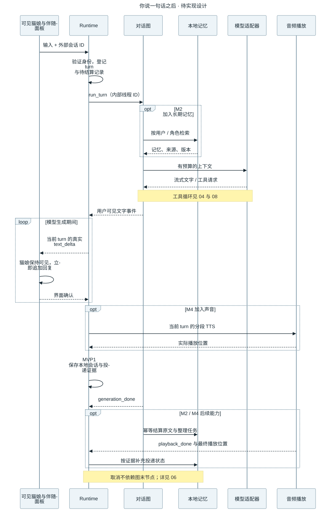

[查看 SVG 大图](diagrams/svg/02-turn.svg) · [编辑 Mermaid 源文件](diagrams/src/02-turn.mmd)

- 输入：用户当前输入
- 处理：Runtime 登记回合，LangGraph 调模型或查攻略，text_delta 按 turn 与 seq 逐段投递；停止生成后拒收旧输出。
- 输出：猫娘旁可见的流式文字、来源和本地会话记录；M2 再加入长期整理任务。
- 边界：不能等整段回答完成再用打字动画冒充流式。取消和崩溃走独立收尾；发送片段不能直接算已显示或已听到。

复用与学习：教学主线参考流式、上下文、语音输出和记忆写入。 对应课程 L02、L03、L06、L09，见 [教程与源码映射](REFERENCES.md)。

## 03 · 本机 API 与事件为什么要有身份

**流程图 · M0 / M1 · 设计未实现**

前端能不能只给一个 thread_id 就读取记忆？

本机服务先验证连接和会话所有者，再把数据交给 Runtime；输出事件也带明确归属。


[查看 SVG 大图](diagrams/svg/03-api.svg) · [编辑 Mermaid 源文件](diagrams/src/03-api.mmd)

- 输入：连接令牌、来源、角色、外部会话 ID 和用户输入
- 处理：loopback 入口校验 → 身份映射 → Runtime → 事件适配。
- 输出：只送给当前所属界面的事件。
- 边界：无效连接拒绝；旧 turn 或重复 seq 不拼接到新消息。

复用与学习：借鉴已有 WebSocket/前端交互，通过显式映射适配，不宣称原 UI 无改动可接。 对应课程 L02、L13、L23，见 [教程与源码映射](REFERENCES.md)。

## 04 · LangGraph 如何完成一轮对话

**流程图 · M1 · 设计未实现**

谁决定下一步是回答、调用工具，还是结束？

LangGraph 是唯一对话决策中心。它读取记忆、生成回复，并在最多 3 轮工具调用后收口。内部整理节点的文字不会直接显示给用户。


[查看 SVG 大图](diagrams/svg/04-graph.svg) · [编辑 Mermaid 源文件](diagrams/src/04-graph.mmd)

- 输入：经 Runtime 归属到用户、角色、内部会话及 turn_id 的当前输入。
- 处理：校验 → 检索与上下文预算 → 模型 → 可选搜索/正文读取 → 幂等提交。攻略的来源证据随结果返回；流式文字经用途与当前轮过滤后发送。
- 输出：可见文字事件、工具结果、持久对话记录和待整理任务；generation_done 只标记生成结束。
- 边界：超限给出有限回复或明确错误；网络与工具失败有各自结果。图可能因取消不再到达末节点，因此取消结算必须由 Runtime 独立执行。

复用与学习：重写 LangGraph 编排；N.E.K.O 工具循环只参考行为，不能作为完整黑盒再套一层。 对应课程 L01、L02、L03、L17，见 [教程与源码映射](REFERENCES.md)。

## 05 · Runtime 如何管理当前轮与独立收尾

**状态图 · M1 / M4 · 设计未实现**

为什么生成结束、播放结束和记忆保存不是同一件事？

状态图分为两个并行职责：当前轮区调度生成和媒体；结算区按回合处理持久结算。旧轮收尾可继续运行，新输入不被旧生成任务占有。


[查看 SVG 大图](diagrams/svg/05-runtime.svg) · [编辑 Mermaid 源文件](diagrams/src/05-runtime.mmd)

- 输入：文字、语音或主动事件，以及生成完成、播放回执、取消、关闭与恢复事件。
- 处理：接受输入先持久登记；同一会话输入排队或抢占。生成结束后仍可能等待播放。正常结束、取消和恢复都提交到同一幂等结算路径。
- 输出：明确的当前 turn_id、有效事件流、播放状态和独立的结算状态。
- 边界：登记失败不启动图；取消先让旧轮失效并停止媒体。结算超时由持久记录恢复，不能被旧任务取消连带杀死；退出停止接收并清理本工程资源。

复用与学习：参考 N.E.K.O 会话、流式输出与退出约束；按新图边界重写协调层，不复用整套会话决策循环。 对应课程 L02、L06、L09、L24，见 [教程与源码映射](REFERENCES.md)。

## 06 · 用户插话时如何立即停止旧声音

**时序图 · M1 / M4 · 设计未实现**

已经取消的回复，为什么有时还会继续播放？

取消生成只处理了任务的一部分。ai-neko 的设计先使旧轮失效并停播放器、清队列，再取消图和模型；每个消费者继续拒收旧片段。

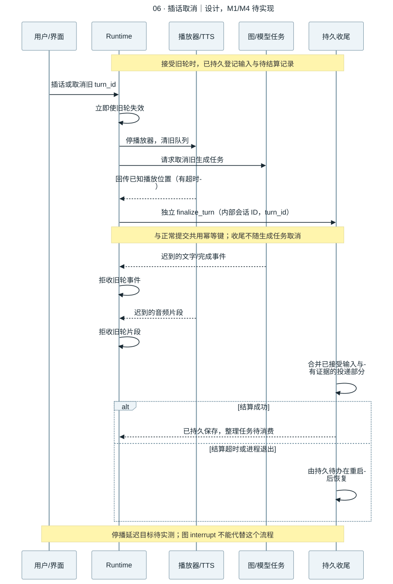

[查看 SVG 大图](diagrams/svg/06-cancellation.svg) · [编辑 Mermaid 源文件](diagrams/src/06-cancellation.mmd)

- 输入：插话或取消事件、旧 turn_id，以及此前已经落盘的输入和待结算记录。
- 处理：停播与失效 → 取消生成 → 独立 finalize_turn → 合并投递证据。正常提交和取消共用 internal_thread_id + turn_id 幂等键，避免追加两条对话。
- 输出：旧声音停止，旧片段被丢弃，已接受输入与有证据的部分回复被保存；未确认范围明确标注。
- 边界：区分已发送、界面确认与实际播放位置。结算失败或崩溃由持久待办恢复；不依赖图末节点，也不把尚未播放的语音当作用户已听到。20 次停播 p95≤300ms 是待验证目标。

复用与学习：参考原版取消、播放和轮次处理；适配到本工程统一事件信封。LangGraph interrupt 是暂停等待输入，不是这个停播动作。 对应课程 L02、L04、L06、L09，见 [教程与源码映射](REFERENCES.md)。

## 07 · ModelAdapter 如何接入云模型

**流程图 · M1 · 设计未实现**

换模型时，哪些地方需要改？

模型适配器把项目消息转换为供应商请求，再把返回值统一为文字、工具请求、用量或错误。它负责协议，不另建自主对话循环。


[查看 SVG 大图](diagrams/svg/07-model.svg) · [编辑 Mermaid 源文件](diagrams/src/07-model.mmd)

- 输入：messages、tools、task_config、turn_id；端点和凭据由本工程配置提供。
- 处理：协议转换 → SDK 调用 → 流式事件归一 → 保留任务与轮次归属 → 返回图或事件桥。重试策略必须有限，并尊重取消和是否已投递。
- 输出：统一的回复片段、工具请求、usage 与错误，供图路由和 Runtime 消费。
- 边界：认证失败、断网、不兼容消息和超时要显式返回；旧轮晚返回不能进入新轮。选中的对话上下文会发送到配置的云端。

复用与学习：可选择性提取 N.E.K.O 自有 SDK 客户端；其中 ChatOpenAI 不是 langchain_openai.ChatOpenAI，不能假定直接兼容。 对应课程 L01、L03、L19，见 [教程与源码映射](REFERENCES.md)。

## 08 · 查攻略怎样从搜索走到有来源的回答

**流程图 · M1 / M5 查询联动 · 设计未实现**

怎样查到攻略、读到正文，再给出适合当前版本的步骤？

M1 就提供搜索和公开网页正文读取，由 LangGraph 整理步骤并附来源。键鼠自动操作和电脑控制当前不做。


[查看 SVG 大图](diagrams/svg/08-tools.svg) · [编辑 Mermaid 源文件](diagrams/src/08-tools.mmd)

- 输入：当前问题、已有主题/平台/版本条件、tool_call_id、turn_id 与预算；M5 可加入用户主动提供的图片。
- 处理：条件不足先澄清 → 查询公开资料 → 读取正文 → 关联段落和步骤 → 带链接返回。工具执行器校验参数、公开地址、预算与当前轮；合成测试和真实联网验收分列。
- 输出：在猫娘伴随面板展示带来源的攻略步骤，标明只读摘要、正文读取成功或无法读取；猫娘保持可见。
- 边界：搜索摘要不是已读全文；抓取时间不是更新时间；网页指令不授予权限。拒绝本机/内网地址并校验重定向，迟到结果不进入新轮。

复用与学习：R07 工具协议与 R08 搜索适配按需提取；不接入旧完整 Agent、个人浏览器配置或键鼠执行器。供应商 adapter 不另建规划循环。 对应课程 L03、L17、L18、L19、L21，见 [教程与源码映射](REFERENCES.md)。

## 09 · checkpoint 如何恢复会话而不串用角色资料

**流程图 · M0 / M1 / M2 · 设计未实现**

两个角色使用同一个会话名称，为什么不能读到彼此历史？

外部会话 ID 只是一项输入。后端为所属用户和角色绑定独立内部 ID，所有入口先校验所有者。恢复时还要确认旧上下文没有包含已删除或已纠正记忆。


[查看 SVG 大图](diagrams/svg/09-checkpoints.svg) · [编辑 Mermaid 源文件](diagrams/src/09-checkpoints.mmd)

- 输入：受信任的本机身份、角色配置、外部 thread_id，以及查询、运行、恢复或删除请求。
- 处理：查持久映射并校验 → 只把 internal_thread_id 传给 configurable.thread_id → 读取本地 checkpoint → 恢复前核对记忆版本及来源 → 必要时重建上下文。
- 输出：本会话消息、节点状态和执行位置；跨会话事实始终由 Memory Service 提供。
- 边界：任意外部 ID 不能直接读 checkpoint。角色切换或所有者不匹配必须拒绝；旧记忆副本不能越过版本与删除策略恢复。不能用 InMemorySaver 宣称退出后可恢复。

复用与学习：内部线程映射和 LangGraph 持久化由本工程实现；参考原版范围与数据布局，但不读取其 checkpoint、运行资料或 Key。 对应课程 L02、L09、L11、L23，见 [教程与源码映射](REFERENCES.md)。

## 10 · 长期记忆如何写入和找回来

**流程图 · M2 · 设计未实现**

换一个聊天窗口、重启电脑后，为什么还能记得我说过的事情？

待实现设计：原文与任务先持久记录，后台提取有效事实；新会话通过同一个 Memory Service 检索，而非依赖旧会话 checkpoint。


[查看 SVG 大图](diagrams/svg/10-memory.svg) · [编辑 Mermaid 源文件](diagrams/src/10-memory.mmd)

- 输入：带用户、角色和回合归属的原文及投递证据；检索时传入范围、查询、时间和预算。
- 处理：worker 按 source_id/job_id 重试去重；版本/删除标记校验与权威内容写入必须处于同一受控提交边界，防止检查后发生遗忘再被旧任务覆盖。检索先过滤范围与有效性，再排序裁剪；索引可重建。
- 输出：可追溯到 source_id 的有效内容、时间和 memory_revision，供对话图构造上下文。
- 边界：落盘失败不能宣称已经记住；worker 异常留持久任务待恢复，失效任务终止。原版原文、outbox 与索引跨文件，不能直接宣称一次事务覆盖所有存储。

复用与学习：计划评估移植 recent/facts/hybrid_recall/outbox 的必要实现；路径、模型和任务依赖要注入本工程，尚未移植或运行。 对应课程 L09、L10、L11，见 [教程与源码映射](REFERENCES.md)。

## 11 · 原文、事实、任务和 checkpoint 有什么关系

**概念 ER 图 · M2 · 设计未实现**

“聊天记录”“我喜欢茶这个事实”和“程序运行到哪一步”分别保存什么？

待实现概念关系，不是最终数据库 DDL：原文提供证据，事实表达当前有效记忆，任务负责整理；checkpoint 保存会话执行状态。


[查看 SVG 大图](diagrams/svg/11-memory-data.svg) · [编辑 Mermaid 源文件](diagrams/src/11-memory-data.mmd)

- 输入：已接受的回合、确认的投递状态，以及用户与角色的可信范围。
- 处理：每条事实可追溯来源，任务保留幂等 ID 与预期版本；修订记录决定有效性，派生索引从权威内容重建。checkpoint 归属由后端校验。
- 输出：可分别回答内容来自哪里、属于谁、是否仍有效、整理是否完成以及会话如何恢复的数据关系。
- 边界：图中字段只是需要表达的概念；不承诺迁入后全部变成一张或一个 SQLite 库。checkpoint 中的旧上下文必须受遗忘与版本检查约束。

复用与学习：参考 N.E.K.O 的原始日志、recent/facts 与持久任务关系；具体 JSON/SQLite/NDJSON 布局、迁移和锁策略由 M0/M2 验证。 对应课程 L09、L10、L11、L23，见 [教程与源码映射](REFERENCES.md)。

## 12 · 纠正和遗忘为什么不只是删除一行

**流程图 · M2 / M6 · 设计未实现**

把“喜欢咖啡”改成“喜欢茶”，或要求彻底忘掉，旧信息怎样避免再次出现？

待实现设计：纠正建立新的有效事实并保留依据；遗忘还要处理原文、派生物、索引、checkpoint 副本和后台任务。


[查看 SVG 大图](diagrams/svg/12-memory-forget.svg) · [编辑 Mermaid 源文件](diagrams/src/12-memory-forget.mmd)

- 输入：设置页的纠正或遗忘请求，以及目标内容和可信用户/角色范围。
- 处理：先持久登记版本和变更，再清理各类副本；worker 的版本校验与权威写入共用受控提交边界，旧 checkpoint 恢复前重建上下文。备份恢复也必须重新应用删除策略。
- 输出：有效的新事实，或在检索、生成和恢复路径中均不再可用的被遗忘内容；各项清理有可追踪状态。
- 边界：一处清理失败就保留待处理状态，不能提前宣布全部遗忘。备份保留期、实际擦除与恢复时删除标记的保留方案仍须在 M2/M6 实现验证。

复用与学习：参考 fact_dedup、persona/corrections 与生命周期教程；跨存储清理和 checkpoint 防回流由新工程统一落实，尚未完成。 对应课程 L11、L23，见 [教程与源码映射](REFERENCES.md)。

## 13 · 我说话、它回答、我插嘴时如何立即停声

**时序图 · M4 · 设计未实现**

声音怎样经过 LangGraph？用户插话时，谁负责停止正在播的那一句？

待实现设计：ASR 把声音变成文字，统一对话图产出回复，再由 TTS 合成播放；Runtime 负责轮次与取消。

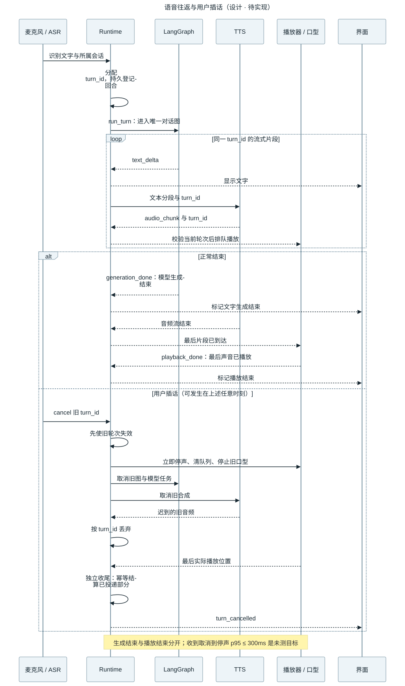

[查看 SVG 大图](diagrams/svg/13-audio.svg) · [编辑 Mermaid 源文件](diagrams/src/13-audio.mmd)

- 输入：麦克风音频及识别文本；用户插话产生的旧 turn_id 取消事件。
- 处理：同一 turn_id 贯穿图、TTS 和播放器。取消时使旧轮失效，先停播放清队列，再取消图和合成；迟到片段继续按轮次丢弃。
- 输出：可听见的回复、同步口型与独立的 generation_done/playback_done；取消回合按实际投递证据结算。
- 边界：生成结束不能算播放结束，发送音频不能算用户听到。应用收到取消到旧音频停止的 p95≤300ms 仅为待测目标，用户开口到识别出取消的延迟另测。

复用与学习：计划提取麦克风采集、一种 ASR、一种 TTS 和播放路径；回调、队列、配置与口型桥接仍需适配和 Windows 真机试听。 对应课程 L02、L04、L06，见 [教程与源码映射](REFERENCES.md)。

## 14 · 看图和主动搭话怎样加入同一个系统

**流程图 · M5 · 设计未实现**

它什么时候可以看图或主动说话？会不会和用户正在说的话抢占同一轮？

待实现设计：手动视觉输入和主动触发各自做开关/有效性检查，然后进入同一个 Runtime 与 LangGraph。


[查看 SVG 大图](diagrams/svg/14-vision-proactive.svg) · [编辑 Mermaid 源文件](diagrams/src/14-vision-proactive.mmd)

- 输入：用户主动选择的图像，或带触发原因的定时/活动事件；首版不默认持续采集屏幕。
- 处理：图像做大小、格式和归属检查；可复用 M1 搜索/正文读取来解释图片相关攻略。主动事件遵守静音、忙碌、冷却与开关；Runtime 统一排队，用户输入优先。
- 输出：由唯一对话图生成的回复；界面可见来源、触发原因和启停状态，所有媒体结果绑定当前回合。
- 边界：关闭视觉后不采集/发送新图，旧截图和迟到结果丢弃；模型不支持图片时明确报错。图片不足以确定版本时不猜测；键鼠/电脑控制不在范围内。退出清理任务。

复用与学习：评估图片规范化、multimodal_turn 与活动门控逻辑；旧 proactive service 的完整生成流程不并行启动。当前只有设计。 对应课程 L07、L08，见 [教程与源码映射](REFERENCES.md)。

## 15 · 围绕可见猫娘完成文字流式最小闭环

**模块流程图 · M1（MVP1）/ M3 / M4 · 设计未实现**

怎样保证最小闭环的主体始终是桌面猫娘？

MVP1 首屏就是透明无边框猫娘，点击她打开伴随输入和回复气泡或面板；聊天和设置时她仍可见。默认建议单一 Live2D 猫娘，具体素材和分发许可尚待确认。


[查看 SVG 大图](diagrams/svg/15-ui-avatar.svg) · [编辑 Mermaid 源文件](diagrams/src/15-ui-avatar.mmd)

- 输入：用户点击、拖拽、文字、停止与设置，以及带角色/会话/turn_id/seq 的真实生成片段、来源和终态。
- 处理：按归属检查并去重；在模型生成期间立即追加文字，映射待机/思考/回复/错误等简单状态。M3 再丰富动作与角色；M4 由实际声音驱动口型。
- 输出：具备基础待机与眨眼的可见猫娘、真实流式回复、停止按钮和可核对来源；会话本地保存。
- 边界：角色加载失败需显示可重试错误，不能用占位图算完成。取消、重连后不拼接旧输出；完整回答后的打字动画不算真实流式。角色许可或随包分发权未确认时不发布该素材。

复用与学习：可评估已有渲染路径与消息展示组件，必须适配本工程事件和资源地址、核实素材许可证；不承诺外部 N.E.K.O.-PC 壳已可用。 对应课程 L12、L13、L14、L06，见 [教程与源码映射](REFERENCES.md)。

## 16 · 本地资料放在哪里

**部署与数据边界图 · M0 / M2 / M6 · 设计未实现**

ai-neko 如何与原版互不干扰？

程序目录与用户数据分开，全部路径来自 ai-neko 自己的解析器。


[查看 SVG 大图](diagrams/svg/16-isolation.svg) · [编辑 Mermaid 源文件](diagrams/src/16-isolation.mmd)

- 输入：平台路径、独立配置或 AI_NEKO_DATA_DIR 测试覆盖
- 处理：解析并校验本工程根；禁止自动回退到原版路径。
- 输出：独立配置、记忆、checkpoint、备份与 runtime 信息。
- 边界：非法路径、端口冲突、第二实例要有明确结果；备份恢复保留删除策略。

复用与学习：复用路径处理思路，应用身份与默认值必须重新定义。 对应课程 L23、L24，见 [教程与源码映射](REFERENCES.md)。

## 17 · 窗口、托盘与启动由谁负责

**流程图 · M0 / M1（MVP1） · 设计未实现**

怎样让下载的应用启动后直接出现猫娘，并能找回和退出？

必要 Electron 宿主前移到 MVP1，管理透明无边框猫娘、伴随聊天面板、拖拽位置和基本托盘；不再把基础桌面体验推迟到 M3。


[查看 SVG 大图](diagrams/svg/17-desktop.svg) · [编辑 Mermaid 源文件](diagrams/src/17-desktop.mmd)

- 输入：桌面入口与独立应用身份
- 处理：独立启动与单实例 → 自有后端健康检查 → 猫娘可见 → 点击输入与流式回复 → 保存位置和会话 → 托盘找回或退出清理。
- 输出：可见猫娘桌宠及伴随面板；聊天和设置时角色仍在，窗口移出屏幕后可从托盘找回。
- 边界：N.E.K.O.-PC 的访问、许可和接口仍未验证；只打开浏览器、普通聊天窗口或角色占位都不满足 MVP1。Windows Server CI 不能代替 Windows 11 桌面真机体验。

复用与学习：采用本工程必要 Electron 宿主的规划；参考组件须逐项核实来源和许可，不能借用原版运行环境。 对应课程 L13、L14、L24，见 [教程与源码映射](REFERENCES.md)。

## 18 · 从 GitHub 下载到 Windows 真机验收

**流程图 · M0 / M1 / M6 · 设计未实现**

什么时候能下载，CI 通过后还需要验证什么？

下载链路已经建立，但历史 0.2.0-alpha.1 只有网页工程预览。MVP1 要把桌面宿主、本工程后端和许可允许分发的猫娘素材一并打包，以启动即可见猫娘并完成文字闭环作为交付门槛。


[查看 SVG 大图](diagrams/svg/18-delivery.svg) · [编辑 Mermaid 源文件](diagrams/src/18-delivery.mmd)

- 输入：版本化源码、产品依赖锁、许可与资源清单
- 处理：源码/依赖/素材许可检查 → Windows + Linux 测试 → Windows Server 构建 → 解压后验证真实桌宠和文字闭环 → GitHub 对应版本下载 → Windows 11 真机另验；M6 再做完整升级恢复和长期观察。
- 输出：无需用户安装 Python 或 Node 的 Windows 便携 ZIP，附 SHA256、源 commit、依赖锁、素材许可、构建环境和脱敏验证记录。
- 边界：包验证失败阻止发布。构建成功、网页聊天通过或规划图通过均不等于 MVP1 已交付；素材缺失、许可未确认或猫娘不显示不能验收通过。

复用与学习：参考原版构建入口，按新应用身份重新验证；不沿用原版通过结论。 对应课程 L23、L24，见 [教程与源码映射](REFERENCES.md)。

## 19 · 教程和 N.E.K.O 代码怎样变成自己的模块

**流程图 · M0–M6 · 设计未实现**

可以照着现有代码做，具体要经过什么？

先理解课程和源函数，再拆出边界，记录来源并在新项目重新验证。


[查看 SVG 大图](diagrams/svg/19-reuse.svg) · [编辑 Mermaid 源文件](diagrams/src/19-reuse.mmd)

- 输入：24 课、来源清单和只读参考仓库
- 处理：学习 → 追代码 → 查来源与许可 → 适配 → 确定性测试 → 真机/真模型。
- 输出：有独立接口、来源记录和本工程证据的组件。
- 边界：教程实验通过只是教材证据；后续扩展不能偷偷进入首版验收范围。

复用与学习：界面、角色、音频、记忆可选择性移植；旧完整对话循环不嵌入新图。 对应课程 L01、L12、L18、L23、L24，见 [教程与源码映射](REFERENCES.md)。
