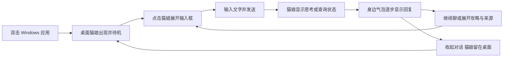

# MVP1：可见猫娘桌宠的文字陪伴闭环

更新：2026-09-26。状态：`v0.3.0-alpha.1` 桌宠工程预览已发布，Windows CI 实际打包桌宠9项验证通过；真实服务与 Windows 11 真机等完整验收仍 Partial。用户明确项目主体是桌面的猫娘桌宠，文字交互、流式回复和查攻略都围绕她展开。本规格修正此前“网页 M1 → 记忆 M2 → 桌面 M3”的交付顺序；MVP1 对应重新定义后的 M1，不另建一套产品阶段编号。

预期交付：从 GitHub 下载 Windows 包，解压双击后，一位猫娘出现在桌面上。点击她即可输入文字，她在身边的气泡中逐步回复；可以停止回复、继续聊天或让她查攻略。收起对话后她继续待机，退出再打开能接续原会话。

当前下载版本为 [v0.3.0-alpha.1](https://github.com/FrigidCrow/ai-neko/releases/tag/v0.3.0-alpha.1)，解压双击根目录 `ai-neko.exe` 显示用户确认的白裙 YUI 猫娘。历史 `v0.2.0-alpha.1` 是网页工程预览，保留其发布记录。测试与未验收项见 [REVIEW](../REVIEW.md)；源码、模型请求或打包通过不等于全部桌宠体验通过。

## 1. 用户体验契约

- **启动即见角色**：默认在主屏工作区右下方显示透明背景、无边框的猫娘。模型未配置或网络不可用时，猫娘仍可见，并给出设置/重试入口；首次出现不依赖云请求。
- **输入围绕角色**：单击猫娘展开贴近角色的输入框，Enter 发送、Shift+Enter 换行；中文输入法确认候选不触发发送。拖拽与点击有移动阈值区分，不误发消息。
- **回复围绕角色**：正文在猫娘身旁的气泡实时增量显示。长回复展开为可滚动的伴随面板，自动避让角色和屏幕边缘；猫娘在普通聊天、查攻略、历史和设置操作期间仍可见。用户主动隐藏桌宠时除外。
- **流式真实发生**：收到模型片段即投递到当前回合；完整回答到达前已有正文可见。不能拿完整回复再加打字动画代替流式。内部工具规划和推理不显示为猫娘说的话。
- **能停、能恢复**：生成时显示“停止回复”；取消后保留已显示内容并标为已停止，迟到片段不能追加到下一轮。已接受但异常中断的输入保留中断状态，可由用户主动重试，重启不自动重放外部调用。
- **日常不打扰**：待机不抢键盘焦点；提供置顶开关、拖拽位置和角色大小设置。收起气泡只收起对话；托盘提供显示/隐藏、恢复位置、设置、退出。退出才结束本应用后端。
- **不用时仍可找回**：保存位置和大小，重开恢复；显示器拔出、分辨率或缩放变化时回到可见工作区。透明空白处不拦截桌面点击，角色/输入/气泡区域可交互。

## 2. MVP1 必需范围

| 能力 | 首版交付与验收重点 | 当前基础 |
| --- | --- | --- |
| 一位可见猫娘 | 一个随包可用的猫娘角色，待机、眨眼及少量状态表现；不是图标、占位框或只在设置页展示的头像 | 已接入用户确认的 YUI Lolita 猫娘；独立资源清单与渲染实测 |
| 桌宠宿主 | 透明无边框、基本拖拽/缩放/置顶、托盘找回、单实例、退出清理 | Electron 宿主已实现；Windows 交互体验单列验收 |
| 文字交互 | 伴随输入框、流式气泡、长文滚动、停止、明确错误/重试 | 已接入桌宠伴随面板，复用已有模型/API/事件与取消 |
| 固定猫娘身份 | 一个固定角色身份与人设，图和界面使用同一角色标识 | 固定小猫身份与 YUI 猫娘外观；角色范围保持一致 |
| 本地会话 | 恢复上次会话、历史、新对话；切换会话不会串入旧回复 | SQLite 会话和结算已有；不等于长期事实记忆 |
| 查攻略 | 同一个输入框提问，可显式选“查攻略”；查询状态、步骤和来源显示在角色旁 | 搜索/正文/来源已实现；真实服务质量仍待验收 |
| 必要设置 | 从猫娘菜单或托盘配置模型、搜索凭据、角色大小/置顶；错误可回到设置修正 | 模型/搜索配置和 Windows 凭据存储可复用 |
| Windows 下载 | ZIP 包含宿主、后端、默认角色、运行依赖与通知；双击无需终端或另装运行时 | 已扩展 Electron＋后端＋角色打包与实际桌面探针；发布结果见 REVIEW |

首版只做一个角色、一条文字交互路径。语音/口型、长期偏好与人格记忆、视觉采集、主动搭话、多角色切换、换装、模型商城、插件和自动升级放到后续阶段。键鼠代操作、游戏接管和电脑控制保持不做。公开攻略查询保留在 MVP1；搜索服务没配置时明确提示，普通文字聊天仍可用。

## 3. 角色表现与素材决策

已选定并经用户确认：**N.E.K.O 默认 YUI Lolita 猫娘**，黑发猫耳、白裙；接入待机/眨眼及状态表现。资源、SDK/Core、wrapper 的来源与适用条件分别记录在 [资源说明](MVP1-ASSETS.md) 和 [逐文件清单](mvp1-assets-manifest.json)。不再使用早期渲染探针的 Mao 魔女模型。

角色与 SDK 是独立依赖：实施的第一关是确认角色外观、可获得的模型文件、适配的渲染版本，以及可随公开 GitHub ZIP 分发的许可和通知。记录来源 URL/commit、文件摘要、作者、许可、修改及升级方式。可下载或可个人使用不自动等于可再分发；原项目根许可证也不能替代素材许可。官方示例页同样要求查阅素材协议与示例使用条款，具体候选须逐项核对。[Live2D 示例说明](https://www.live2d.com/en/learn/sample/)

没有合适资源时，继续完成宿主与接口探针，明确保留“默认猫娘素材未定”缺口；不能把未获许可的资源放进 Release，也不因资源缺口退回网页作为 MVP1。需要新作素材时另行落实形象设计与制作，不能将一张图片声称为可动画的 Live2D 模型。

角色状态由当前回合事件驱动，首版不新增情绪推断模型调用：

| 事件状态 | 用户可见反馈 |
| --- | --- |
| 启动/待机 | 猫娘待机动作、眨眼；服务启动时有短状态提示 |
| 已接受输入、等待首字 | 思考状态和“正在想…”提示 |
| 搜索/读正文 | “正在查资料…”；失败或资料不足如实显示 |
| 正在生成 | 回复气泡持续增长，角色使用简单回应表现，不模拟语音口型 |
| 完成/停止/失败 | 回到待机；保留正文及明确的停止/错误提示，必要时给重试入口 |

状态均绑定当前 session_id/turn_id。切换会话、停止或新回合后丢弃旧状态，避免猫娘继续表现上一轮的“思考”。

## 4. 实施顺序与交付关卡

先验证最关键的可见桌宠，再接现有后端。以下是顺序与负责人职责，不是未经验证的工期承诺；完成 A 的资源/渲染探针后再估算剩余工期。

| 关卡 | 责任边界 | 交付物与过关条件 | 依赖 |
| --- | --- | --- | --- |
| A：猫娘站到桌面上 | 桌面/角色实现者 | 资源与许可清单；Windows 透明窗口里实际渲染猫娘和待机动画；拖拽、基本点击区域可用；截图/短录屏证明在桌面可见 | M0 独立身份；可用资源 |
| B：和她完成一轮对话 | 交互实现者＋Runtime 集成者 | 点击猫娘→输入→首字→增量回复→完成；猫娘始终可见；先用合成流测试，再使用配置的真实模型 | A；现有 M1 API |
| C：能持续使用 | 桌面/交互/Runtime 实现者 | 停止与失败重试、历史恢复、新会话、查攻略来源、配置入口、托盘、位置恢复、退出清理；旧事件不串轮 | B；现有查询/持久化 |
| D：下载包验收 | 构建/验收实现者 | CI 构建带宿主/角色的 Windows 包；实际解压运行桌宠闭环；Windows 11 真机留证；新版本 Release 与摘要 | A–C |

MVP1 完成条件是 A–D 必要项通过。后端已有功能保留原测试证据，只对新增桌面及其集成补验；不用重写 LangGraph、模型/搜索协议或会话存储。A 的截图不代表 B–D 完成，D 的 CI 不代表真机完成。

## 5. 技术边界

沿用已选最小 Electron 宿主，承载本项目的桌宠界面与角色渲染。Electron 主进程管理窗口、托盘和自己启动的后端；界面只管输入、状态和显示；SessionRuntime 管理回合与取消；LangGraph 仍是唯一模型/工具决策中心。UI 的 HTML/CSS/JavaScript 可以复用，但用户的默认入口必须是桌面猫娘。

当前增量轮询、序号和 ACK 可以复用。首版不为“流式”强行重写成另一套传输：先以真实片段提前显示、界面响应及有序恢复验收；测量证明现有方式不足时再调整。角色窗口与对话面板共享一个事件消费与确认协调器，不能各自重复发起模型调用或用隐藏面板伪造显示确认。

桌面与后端通过本工程实例身份、私有连接信息和鉴权接口连接，不接管未知服务，不读取原版资料。关闭聊天面板保留桌宠；托盘退出取消回合并清理自己拥有的进程。宿主异常结束须有本应用后端的兜底退出机制；不得按进程名广泛结束服务。

透明窗口和穿透必须独立验证：透明像素不会自动获得鼠标穿透，需实现明确的交互区域与找回入口。[Electron 窗口说明](https://www.electronjs.org/docs/latest/tutorial/custom-window-styles)

渲染进程开启上下文隔离和 sandbox，关闭 Node 集成；preload 只暴露有限操作，校验 IPC 来源/参数。禁止任意远程导航/脚本及网页内容获得系统权限；来源链接只在用户点击后按约束交给浏览器。[Electron 安全说明](https://www.electronjs.org/docs/latest/tutorial/security)

## 6. 验收清单

下列是完整验收目标；当前通过与缺口见 [REVIEW](../REVIEW.md) 的 MVP1 实施记录。确定性自动测试、真实模型/搜索和 Windows 11 人工操作分别留证。

| ID | 场景与通过条件 | 所需证据 |
| --- | --- | --- |
| V01 可见桌宠 | 从实际 ZIP 双击启动，不打开默认浏览器或终端作为主界面；未配置模型/断网也出现完整猫娘、待机动画及设置入口 | Windows 11 截图/短录屏、版本/源 commit、包摘要 |
| V02 桌面交互 | 拖拽、缩放、置顶开关、透明空白点击、输入区域命中正确；闲置不抢焦点；收起聊天仍可见，隐藏后托盘可找回 | 100%/150% DPI，屏幕边缘；双显示器与拔出后的找回记录 |
| V03 真实流式 | 当前回合在完整回答完成前显示多个递增片段；中文输入法和多行输入正确；短回复气泡、长文面板均不遮住猫娘 | 合成流 UI 时序与截图；真实模型 10 轮单列；记录首字耗时 |
| V04 显示延迟 | 合成连续片段的“后端可投递→屏幕显示”p95 目标不超过 500ms，至少 20 个片段；模型首字等待另计，不混入 UI 指标 | 时序采样、机器/DPI/版本；目标未达如实记录 |
| V05 停止/失败 | 首字前、流式中、完成边界分别停止；连续操作 10 次不串字/重复提交；断网、401、超时明确提示且猫娘仍可操作 | 合成错误/迟到事件自动验证，真实窗口操作记录 |
| V06 持久会话 | 正常退出重开能续接上次会话，已确认文字不丢；崩溃后记录中断；新会话不串旧回复，旧来源不当作新查到资料 | 至少 3 次正常重开、1 次强制结束；无自动外部请求重放 |
| V07 攻略闭环 | 从猫娘旁发起查询，显示进度、步骤和可点击来源；区分摘要/正文/失败；来源缺口明确 | 现有合成场景回归＋3 次真实搜索→正文→回答人工核对 |
| V08 生命周期/隔离 | 第二次启动唤回已有桌宠；退出取消生成并清理本应用后端；宿主异常退出可恢复；同机其他应用不受影响 | 包内真实进程检查、端口/文件身份、原版共存人工记录 |
| V09 包与素材 | 下载包内置运行时和默认角色，中文路径可运行；资源许可/通知与摘要齐全；升级试用沿用 ai-neko 原会话/凭据且不迁移原版资料 | CI 原生构建、实际下载摘要核对、无开发工具 Windows 11；旧 alpha 数据备份后的保留验证 |

全部必要项通过才称为“桌宠 MVP1 可试用”。若只能完成 CI，则标注桌宠工程预览及具体缺口。当前缺真实服务凭据，不能预先声称 10 轮/3 次质量验收通过。

## 7. 后续阶段与现有发布

- M0：保留基础隔离和 Windows 环境收尾。
- **M1 / MVP1：本规格的可见猫娘＋文字流式交互＋查询＋桌面下载闭环。** 原 M3 的基础宿主、单角色、基本托盘前移到这里。
- M2：跨会话长期事实/偏好记忆、查看/纠正/遗忘。
- M3：角色表现深化、多角色与扩展渲染；基础猫娘不再等 M3。
- M4：语音输入/输出和打断；M5：视觉与主动陪伴；M6：完整产品升级、恢复及长期稳定性。

保留现有 `v0.2.0-alpha.1` 的真实发布记录和功能说明。旧二进制和 tag 保留；桌宠使用 0.3.0 预览线单独发布。完整真机验收前称为桌宠工程预览。
