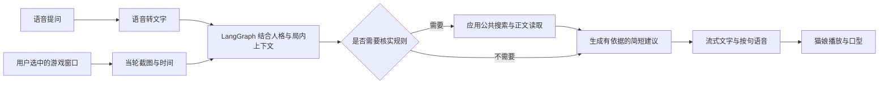

# 下一次交付：有人格的视觉语音陪玩

日期：2026-09-26。状态：五项能力已开始实施，本页保留目标与验收；当前完成证据和缺口以[实施及验收](COMPANION-IMPLEMENTATION.md)为准。沿用M0–M6编号，暂称MVP1.1交付增量；不把合成结果当作真实模型或Windows真机通过。

用户目标：玩《王者万象棋》时，用语音问“我现在怎么玩比较好”“下一步应该怎么做”，猫娘根据当前游戏画面和对话上下文，用自己的性格与声音给出建议。用户操作游戏，猫娘负责观察、解释和建议。

## 1. 已明确需求与待确定条件

已明确：保留 YUI 白裙猫娘；需要猫娘人格、桌面视觉、语音输入与输出；用户补充网络查询计划使用 DeepSeek。所有能力接入本工程同一个 LangGraph。当前 v0.3.0-alpha.1 只有固定角色提示、文字和公开资料查询，不具备截图、麦克风采集或语音播放。

实施建议：第一条完整路径采用按键说话、提问时取图、简短语音回答；随后补免按键对话。按键说话是首版建议，不是用户已确认的交互偏好。DeepSeek 为网络查询的用户选择；暂以官方 API 文档评估，实际官方/第三方渠道、具体模型、语音服务及窗口来源未确定。把 DeepSeek 同时作为文字/视觉主模型是下述候选方案，不冒称用户已经选择全部模块或能共用一份 Key。

待确定：

- 用户使用 DeepSeek 官方 API 还是第三方渠道，具体模型与协议，以及是否也用它承担人格对话和看图判断。分别核实文字、图片、工具调用、原生搜索、ASR、TTS 能力；有文字接口不代表其余接口均可用。
- 游戏是在 Windows 本机/模拟器窗口、投屏窗口，还是未投屏的手机。桌面采集只能获取电脑可用的画面来源；手机不投屏时需额外图像入口。
- 角色口吻和音色先提供可编辑默认值，不推定用户希望“主人”、强口癖或某种关系设定。

## 2. 首次使用到一次回答

1. 选择游戏窗口并预览，选择麦克风和输出设备，试听声音；猫娘显示观察范围及麦克风状态。
2. 在游戏中触发说话入口，不必切出游戏；本应用只接收用户快捷键，不代替用户向游戏发送键鼠操作。
3. 用户说完后，识别文字；同时从已选择的游戏窗口获取新截图，绑定本轮问题、采集时间和来源标识。
4. 模型分清画面已观察到的事实、未知项和推测。需要规则/版本知识时才查询公开资料；短时间内同一份规则可复用，局面状态不得用旧截图冒充。
5. 猫娘先说一项最重要的建议，再简短解释原因。默认游戏回答目标为 1–3 句；用户追问时再展开。完整说明和资料来源显示在伴随面板，不逐字朗读链接。
6. 用户再次提问或停止时，先停旧音频、清队列，再取消剩余生成；新问题使用新截图和新回合。换局时清除局内状态。

## 3. 人格如何落地

采用显式角色档案与统一提示词构建，不要求先微调模型。每轮记录所用档案版本，文字、看图、查询和语音表达使用同一份人格；不能让 TTS 再自行生成另一套建议。

| 层次 | 首个增量 | 与记忆的关系 |
| --- | --- | --- |
| 角色档案 | 名字、称呼、性格、说话风格、口癖频率、回答长度、游戏陪伴风格 | 本地显式配置，用户可以改；不由一条聊天自动覆盖 |
| 行为规则 | 先答当前问题，游戏中短句和明确建议，愿意纠错，看不清就说明 | 人格不能要求编造画面、虚构攻略或故意答错 |
| 当前对话与局内状态 | 游戏/版本/局标识、当轮观察、未确定信息、上一条建议 | 绑定会话与画面，换局清理；金币/阵容等不进入永久偏好 |
| 长期事实和偏好 | 用户已纳入本次目标，由M2 Memory Service负责 | 可查看、纠正、遗忘；checkpoint 不成为第二份长期记忆 |
| 音色与表现 | 音色、语速、音量及真实播放驱动的简单口型 | 属于语音/表现配置；声音不是人格本身 |

建议默认性格：温柔、机灵、能直接指出问题；普通聊天自然，游戏中先给建议再解释。首版保持固定 YUI 形象，不扩展好感度计分或多角色系统。改人格下一轮生效，不为改口吻删除当前局对话。

## 4. 桌面视觉如何落地

- 本项目 Electron 主进程提供受限选源与采集接口；仅可信本地页面可请求，保留现有 sandbox/contextIsolation。首版只捕获用户选定来源，不借用参考项目配置或服务。
- 说完话时取新图，附 `frame_id/source_id/captured_at/turn_id`；采集失败、黑屏、最小化、来源关闭或窗口替换时明确失败，不静默改成全桌面。
- 源中细小文字可通过裁剪/局部再看补充。采用按问题所需的观察项，不假定一张图能读出所有棋子、费用或隐藏对手信息；字段不确定时标记未知。
- 回答必须区分“从画面看到”“基于规则推断”“需要确认”。游戏局面已变或图像过期时，不把旧建议称为当前最优；必要时有界重新取图核对。
- 观察开关停止后关闭本功能全部采集流、计时器和待发送图片；不继承 N.E.K.O 停共享后仍可继续主动视觉或失败后整屏兜底的行为。
- 默认仅在内存保留当轮必要图片，不自动积累桌面相册；使用云视觉模型时，相关图片会发送到用户配置的模型服务。画面文字作为资料，不能改写权限或人格。

## 5. 语音如何落地

首个路径为“麦克风 → ASR → 现有 LangGraph → TTS → 本机播放器”，使图保持唯一决策中心。支持原生实时音频的模型后续仍经同一回合调度接入，不另建完整聊天循环。

- 先提供按键/按钮说话及设备选择；识别文字在界面可见，游戏名和术语通过词表及上下文辅助，不静默将错词当成确定事实。
- 麦克风输入与游戏系统音分开。先用耳机和按键路径验证；免按键模式再引入 VAD、结束判断和回声处理，验收游戏声音/猫娘自己说话不会自动触发新问题。
- LLM 的最终用户可见回复按句缓冲，形成完整句子后交给 TTS；不朗读内部工具规划、调试消息、链接或未确认的中间猜测。网页来源仍在文字面板保留。
- `turn_id/generation/segment_id` 贯穿文字、合成和播放。按序播放，旧轮迟到音频拒收；TTS 失败仍保留文字，不重放模型请求。
- 打断先停止已调度音源、清空播放队列和口型，再取消 ASR/图/TTS 的所属任务；按住说话触发新输入本身也可作为可靠打断。免按键插话识别单独验证。
- 显示确认与播放确认分开记录：生成完毕、下载完毕、显示完毕均不等于用户听完。只根据播放器事件记录可证实播放进度；重启不自动重播旧建议。
- 音色可试听与更换；声线自然程度、中文术语发音、口型和延迟由真实设备及服务验证，不能从配置项或合成测试推定。

## 6. 搜索与游戏知识

用户进一步明确需要通用联网搜索，不接受为每个对话模型重复实现搜索。因此以应用统一搜索层为主：LangGraph 调用共享的 `search_web` / `read_web_page`，搜索后端返回规范化来源与正文，再交给当前对话模型组织答案。模型配置和搜索配置独立；同一搜索服务只配置一次，换模型继续复用。供应商原生搜索是可选后端，不能成为每个模型必须接入的前提。

现有代码已经具备此基础：`chat/graph.py` 注册共享工具并调度 `tools/web.py`，当前搜索后端为 Tavily，正文读取单独执行。当前版 Tavily Key 是应用的搜索服务凭据，不是每个模型各需要一个。后续若更换搜索服务，只在此边界增加 SearchProvider 适配与统一来源格式，并按所选服务能力校验配置；不为每个模型复制搜索逻辑。不同模型的函数调用/流式协议仍由 ModelAdapter 处理，这与搜索后端适配是两件事。对不支持工具调用的模型，可另实现用户显式选择“查攻略”后由图先检索再回答的路径；当前不宣称所有模型已兼容。

“能看图”不等于“懂当前版本玩法”或“知道最优解”。建议由当前画面证据、用户提供的局内信息和可核实的游戏规则组成；最新版本/棋子效果缺失时才查资料，来源与推测分开。规则资料可缓存且记录版本，局内观察不得当作长期规则。先用用户实际游戏场景评估再判断是否需要专门 OCR、图标识别或游戏知识库。

### 6.1 DeepSeek 接入决定与协议核对（2026-09-26）

用户提出网络查询打算用 DeepSeek；后续追问明确要求搜索与模型解耦。DeepSeek 可作为理解问题、调用共享工具及组织答案的对话模型，无需先接其原生搜索。如果用户还希望搜索服务本身采用 DeepSeek 原生搜索，则仅作为统一搜索层的候选后端单独验证一次；暂不把这种选择当成已完成的接入，也不替用户静默更换服务。以下是当日公开文档事实，不是本工程真实 API 验收结果；第三方平台是否保留这些能力需分别确认。

| 能力 | 官方文档可确认内容 | 本工程决定或待验项 |
| --- | --- | --- |
| 看图 | `deepseek-flash` 当前对应 V4.1 Flash，可接收图片；`deepseek-v4-pro` 的能力表明确不支持视觉 | 推荐 Flash 作为对话/截图理解候选；截图、附件和当轮归属仍要在应用实现 |
| 原生搜索 | Claude Code接入文档说明经DeepSeek的Anthropic兼容地址使用Web Search；兼容表列出server_tool_use和web_search_tool_result | 可选后端探针：核对实际搜索、来源、无结果/失败、流式与取消；不阻塞共享搜索路径，不启动Claude Code作第二套agent |
| Responses 搜索 | Responses兼容表明确 `web_search` 等内置工具会被忽略 | 禁止仅传该字段后宣称已联网；不以普通流式文本或模型自述作为搜索成功证据 |
| 普通Chat Completions | 函数工具的实际执行仍由调用方实现 | 当前Tavily函数工具不能因更换model_base_url而自动变成DeepSeek原生搜索 |
| 思考与工具往返 | 思考模式默认开启；带tools时，后续请求需完整回传供应商要求的reasoning_content | 适配器必须保留所需协议上下文或明确使用受支持的非思考模式；内部内容不进入用户气泡或TTS |
| 语音识别/合成 | 本次核对的官方能力表和公开API指南未确认可用ASR/TTS入口 | ASR/TTS继续作为独立可配置适配器，不声称DeepSeek一个Key覆盖听说读图和搜索 |

官方来源：[模型能力表](https://api-docs.deepseek.com/quick_start/pricing/)、[图片输入](https://api-docs.deepseek.com/guides/vision/)、[Claude Code搜索说明](https://api-docs.deepseek.com/quick_start/agent_integrations/claude_code/)、[Anthropic兼容表](https://api-docs.deepseek.com/guides/anthropic_api/)、[Responses兼容表](https://api-docs.deepseek.com/guides/responses_api/)、[思考工具上下文](https://api-docs.deepseek.com/guides/thinking_mode/)。其中Anthropic全文直接打开曾超时，已通过搜索返回的官方页面正文核对，不用超时页面作为成功读取证据。

代码缺口已只读确认：`src/ai_neko/providers.py` 固定Chat Completions、只消费content/tool_calls；`chat/graph.py` 重组函数调用且不保留供应商思考块，来源只消费本地工具结果；`app/api.py` 只接收文字。对话/视觉接入需要明确供应商能力、协议上下文及图像输入；原生搜索来源事件映射只在选择该搜索后端时增加。保留LangGraph统一调度与现有共享工具，不把供应商兼容地址误写成应用已完成适配。

验收先后：无凭据的模型协议与共享工具fixture/错误路径 → 本项目显式凭据下的图像理解及所选搜索服务真实探针 → 游戏界面正确性与来源质量 → 语音闭环。搜索层需验证不同兼容模型复用同一搜索配置、来源格式、正文读取与取消路径；原生搜索探针仅在采用该后端时执行。实际调用前不以官网能力表代替账户支持、运行结果或游戏效果；失败时显示具体缺口，不能静默改用其他服务。

## 7. 实施顺序与完成标准

不等待完整 M2 记忆、多角色 M3 或 M5 主动搭话才交付本场景。本增量提取 M1 的角色配置、M4 的输入/输出/取消、M5 的用户触发视觉，仍保留原阶段剩余验收，不将其整体标完成。

| 顺序 | 责任与范围 | 通过证据 |
| --- | --- | --- |
| A 人格与图片契约 | Root/后端：角色档案、统一注入、当轮图片与局内状态；桌面：窗口选择与一次性截图 | 同组文字/图像问题口吻一致；来源绑定正确；未知画面不编造；关观察后无新采集 |
| B 可听闭环 | 媒体适配：设备、按键录音、ASR、按句TTS；桌面：播放/口型；Root：统一取消 | 同一轮“说话→新截图→判断→出声”成立；无旧音频串入；文字和语音内容一致 |
| C 游戏验证与首个下载包 | Root与用户真机场景：实际Windows游戏窗口、模型/搜索及语音服务；CI/构建保持失败阻止发布 | 实际可见信息逐项核对，建议与场景相关；同源Windows包与下载摘要可核对 |
| D 后续免按键对话 | 在B/C通过后补VAD、回声与插话，不阻塞按键版交付 | 游戏音/猫娘声音不自触发，真实插话能停旧播；作为后续版本单独验收 |

首版验收集合：

- 人格：至少10个覆盖闲聊、游戏建议、纠错和未知信息的场景；持久化/重启档案一致，游戏态口吻不影响事实；实际输出人工评审。
- 视觉：至少10张带人工标注的实际游戏截图，覆盖清晰、模糊、弹窗、不同界面与缺信息；确定性测试验证归属/清理，真实模型识别准确性单列，不用固定回复计入模型能力。
- 语音：至少10轮实际麦克风到扬声器完整对话，含游戏术语、静音输入、网络/设备失败；采集、识别、决策、合成、首个可听音频分段记录耗时。
- 打断：20次跨生成/合成/播放边界的取消；沿用M4目标，应用收到停止事件到旧音频停止p95≤300ms。开口到识别插话的时间单列；该数值仍为待验收目标。
- 时效：分别统计不联网和联网场景“说完话→第一条有用且可听建议”的p50/p95，记录所用截图年龄；不把“我看看”占位语音算有效答案，也不在未选服务前承诺总延迟。
- 质量：真实完整闭环至少10轮，人工核对可见事实、建议可执行性与规则来源；提供至少3次确需联网的完整例子。能发声不等于建议正确，不承诺胜率提升或最优策略。
- 平台：Windows Server CI验证包与合成流程，Windows11真机验证设备、游戏窗口、快捷键不抢焦点、播放与打断、黑屏/来源退出和清理；两类报告分开。

## 8. 复用依据与实现约束

只读参考源码基线 `90ccf79c95e80f899b9bf3395fa8cd9a9bfe29be`：

- 人格：`utils/persona_presets.py`、`utils/config_manager/persona_payload.py`、`main_routers/characters_router/persona.py` 的字段/校验/合成思路；不照搬改人格清历史行为。
- 视觉：`static/app/app-screen.js`、`static/app/app-buttons.js`、`main_logic/omni_offline_client/_streaming.py` 的选源、附件和图像请求边界；独立 N.E.K.O.-PC 主进程/preload不在当前参考源码中，不能承诺直接复制。
- 语音：`static/app/app-audio-capture.js` 的采集与生命周期；`main_logic/tts_client/_infra.py` 的 SentenceBuffer/音频完成与取消思路；`static/app/app-audio-playback.js` 的清队列与实际播放事件。原有全局状态/进程队列/总线不直接导入本项目。
- 优先保留本项目现有取消/会话/查询/鉴权机制。任何实际提取先逐项记录源commit、文件、许可、改动和升级方式；本方案没有导入第三方代码或素材。

Electron官方支持按窗口或屏幕枚举采集来源：[desktopCapturer](https://www.electronjs.org/docs/latest/api/desktop-capturer)。麦克风采集必须落实权限和设备生命周期：[getUserMedia](https://developer.mozilla.org/en-US/docs/Web/API/MediaDevices/getUserMedia)。这些接口存在不代表本应用已实现或已通过Windows游戏实测。

本页列出目标与验收，不代替运行证据。本轮新增实现、实际提取的记忆检索组件及未完成项见[五项能力实施](COMPANION-IMPLEMENTATION.md)；当前阶段以PLAN表为准。真实调用与Windows真机证据继续单列，现有发布版保持不变。
