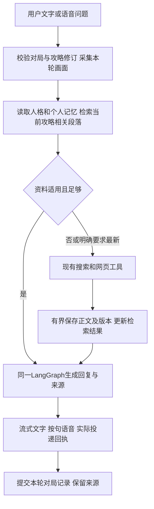

# 下一阶段优化计划：记住攻略，连续陪玩

日期：2026-09-26。状态：**规划完成，G1–G6实现与验收均Pending**。用户本轮要求编写plan，本文件不代表功能已实现，不触发产品改动或新版本发布。

基线为已发布的[v0.4.0-alpha.1](https://github.com/FrigidCrow/ai-neko/releases/tag/v0.4.0-alpha.1)，产品源commit `f359826bd60139a6a9efcef8d959f56c385228ba`，当前文档基线commit `63a4adfa8391695c00df5c993cccc73c5f40c83d`。既有[发布核对](evidence/companion/release-v0.4.0-alpha.1-verification.json)证明Windows Server合成构建/运行，不代替本阶段或Windows11真实陪玩验收。

本增量连接M1查询、M2本地管理和M5视觉陪玩，不重编号M0–M6。候选交付版本为`v0.5.0-alpha.1`，正式版本号在实施收尾时确定。上阶段人格、语音及真实服务的未完成验收继续保留。

## 1. 用户最终体验

用户让猫娘查《王者万象棋》的攻略，在来源卡片选择“采用这份攻略”。之后反复问“这一轮怎么打”“下一步呢”，猫娘知道当前采用的资料，结合新画面、明确的用户描述和本局进度回答。攻略内容适用且足够时直接查本机资料；需要最新规则或缺少依据时才联网。每个建议可查看对应攻略段落。

重启应用后仍能找到采用的攻略，但不能把上次棋盘当当前局面。点击“新对局”保留攻略选择、清空本局动态状态；“切换攻略”后停止旧攻略对应的未完成回复和音频。

本阶段成功的三个核心结果：

1. **接得上：** 当前采用关系、局内目标与历史建议有明确归属，连续追问不换流派、不混新旧对局。
2. **少等待：** 已有适用资料的问题不重复搜索和抓取；仅向模型提交相关段落，分开衡量检索、模型和语音耗时。
3. **能核对：** 知道资料来自哪里、适用版本是否确认、保存是否完整、何时核查，以及如何更新、切换和删除。

## 2. 基线与本轮范围

### 已有能力与明确缺口

| 当前实现 | 下一阶段要补的部分 |
| --- | --- |
| 白裙YUI桌宠、文字/语音输入、流式回复和按句朗读 | 在现有猫娘面板呈现攻略和对局状态，保持同一回合与取消机制 |
| 共享`search_web`和`read_web_page` | 本地资料优先、搜索结果短期缓存、重复在途请求合并 |
| 个人事实/人格的Memory Service和BM25 | 独立类型的攻略文档与版本、段落索引、采用关系，不把网页写成个人事实 |
| 来源事件落入会话日志 | 可按游戏/版本检索的文档库；日志只用于历史展示，不充当文档权威 |
| 最近10轮上下文、当轮截图、120秒图片时效和请求撤销 | 独立对局ID、状态来源/时效、新局历史过滤和重启失效 |

入库必须早于模型上下文裁剪：当前`tools/web.py:source()`最多保留20,000字符，`chat/graph.py:_bounded_source()`再限制为6,000字符。不能从旧事件取出这些片段就标成“已保存整篇”。当前`runtime/service.py:_history()`不会重新检索旧网页正文，且会将历史来源编号改为待重新检索；本阶段增加稳定文档引用后再按回合生成引用编号。

### 首版必须包含

- 用户提供公开URL或采用搜索来源；保存可读取的正文及来源、完整性和版本信息。
- 每个游戏/平台/模式只有一份当前采用攻略，支持切换和取消采用；新对局可以沿用。
- 在同一LangGraph里按当前攻略优先检索，不足时再查询其他资料或联网，并明确区分补充来源。
- 本局状态来自用户明确描述或当轮画面；支持开始、结束、新局、纠正和重启恢复提示。
- 桌宠可操作入口、文字/语音一致、删除与快照恢复约束、可核查的效果和性能报告。

首版不包含视频攻略转录、整站抓取、登录态资料、自动检测开局/结束、持续录屏、自动操作游戏、多攻略自动混编、自动学习胜率最优策略。语义向量检索、复杂知识图谱、供应商专属缓存优化暂不作为交付依赖；新增范围必须先有首版漏检/时延证据。

## 3. 采用的最佳实践与工程决策

| 决策 | 具体应用 | 依据与限制 |
| --- | --- | --- |
| 会话状态、长期记忆和资料分开 | 个人事实/人格保持现有权威；攻略单独类型；本局动态状态由Runtime管理 | [LangGraph记忆概念](https://docs.langchain.com/oss/python/concepts/memory)区分线程内和跨线程数据；框架不会替应用判断哪一局有效 |
| 先取相关资料，再回答 | 有已采用攻略时，确定性本地检索先于模型规划；只在内容/版本不足时进入现有网络工具路径 | [官方Retrieval/RAG说明](https://docs.langchain.com/oss/python/deepagents/retrieval)支持接入已有资料库，不要求重建业务或每轮让模型先决定是否查本地 |
| 文档身份、内容版本、派生索引分离 | 内容哈希去重、稳定文档ID、按段落检索；仅变化的正文重建索引 | 参考[LlamaIndex Ingestion Pipeline](https://developers.llamaindex.ai/python/framework/module_guides/loading/ingestion_pipeline/)的处理缓存和文档管理；它不替代网页刷新策略 |
| 首版复用既有BM25 | 精确攻略引用优先，其次游戏/平台/模式/版本过滤，再排段落相关度 | 保留N.E.K.O分词/繁简处理；用评测判定是否需要向量能力，不先添加新模型和服务 |
| 搜索短期缓存与请求合并 | 同查询并发只发一个外部请求；缓存只减少重复联网，不充当长期资料库 | 参考N.E.K.O `_resilience.py`和`search_gateway.py`，只迁移需要的边界 |
| 模型缓存作为可选收益 | 本地资料库对所有已支持模型共用，不依赖DeepSeek缓存命中 | [DeepSeek上下文缓存](https://api-docs.deepseek.com/guides/kv_cache/)按输入前缀复用、会过期且不保证命中，不能保存本应用的采用关系 |

官方资料核查日期为2026-09-26。本轮不新增LlamaIndex、向量数据库或其他完整agent框架；可以借鉴文档处理设计，确需提取组件时再登记依赖与许可。

N.E.K.O只读参考commit仍为`90ccf79c95e80f899b9bf3395fa8cd9a9bfe29be`：

- `plugin/plugins/web_search/_resilience.py:133–158,241–313`：内存TTL、请求合并和旧结果回退；`plugin/plugins/web_search/__init__.py:935–942`主要拼接标题/snippet。
- `utils/web_scraper/search_gateway.py:25–47,81–111`：网关内存缓存。两者均不能当作退出后保留的攻略正文库。
- `memory/hybrid_recall.py:16–53`：BM25、embedding及RRF的组合可作后续方向；现有[已移植组件](MEMORY-REUSE.md)继续复用。
- 若实际迁入新代码，先在本工程记录原路径、commit、LICENSE/NOTICE、改动和升级方式；不读取参考配置、运行数据或凭据，也不启动其模块。

## 4. 本地数据与权威边界

以下是拟定契约，字段名可在实现时按既有风格调整，但语义和删除/恢复约束不得丢失。

| 数据 | 关键内容 | 所属与生命周期 |
| --- | --- | --- |
| 个人记忆/人格 | 现有事实、来源、纠正/遗忘、角色档案 | 继续由Memory Service管理，不自动从网页形成用户事实 |
| 攻略文档 | `guide_id`、scope、原URL/最终URL、标题、game/platform/mode、创建时间、删除修订 | Memory Service内专门模块和表，沿用本工程`memory/long-term.sqlite`与版本迁移；外部资料不混入事实表 |
| 攻略版本 | `revision_id`、正文、content_hash、内容日期、抓取/最后核查时间、游戏版本及依据、完整性、访问状态、可选ETag/Last-Modified | 不可变内容版本；抓取时间不等于内容更新时间，304不证明适用游戏版本 |
| 片段与索引 | `chunk_id`、revision_id、标题层级、原文范围、文本与检索字段 | 可重建派生数据；与源版本绑定，不成为第二份权威 |
| 当前采用关系 | scope、game/platform/mode、guide_id、revision_id、selection_revision、选择时间 | Memory Service持久保存；跨聊天/重启可恢复。切换模型不换攻略 |
| 对局记录 | match_id、scope、session关联、游戏条件、目标、当前采用修订、状态、state_revision；每项观察的来源/时间/失效时间 | Runtime在自己的会话数据库维护；可保留上局记录，但动态状态在重启/新局失效 |
| 查询缓存 | 搜索提供方配置代次、scope、query/locale、时间、标准结果 | 进程内短期缓存；不保存Key，不跨scope或配置代次复用 |

保存内容以公开网页的清洗正文为主，保留表格/列表结构、来源和段落定位。正文采集受现有响应大小/超时/地址规则限制；另设每篇最多50,000字符的首版保留上限。受限、图片信息未读取或正文超限都标记`partial`并提示可用范围，不能仅凭HTTP200标成全文完成。摘要和建议是派生内容，必须能回到原段落。

拟定自动资料缓存总额100MiB；未采用的自动缓存可按LRU清理，已采用的攻略不自动移除。到达上限且无法回收时，继续提供当轮读取结果但提示未保存，不能显示“已采用且可重启恢复”。限额是初始设计值，需在G6报告实际占用后调整。

同URL同内容重复读取不生成重复版本；同内容但来源不同保留各自来源。URL规范化不随意移除可能决定页面内容的查询参数。旧聊天日志不自动批量入库；用户采用旧来源时重新核对并保存，失败则保留历史片段标识。

## 5. 查询、采用与刷新流程

### 采用与连续追问

- 来源卡片增加“采用这份攻略”。选定来源后，先完成正文和采用关系持久化，再显示成功；snippet、登录页、空页面不能伪装为已保存正文。仅保留片段时明确显示“部分内容”。
- 一个游戏条件组合只有一个当前采用版本。当前局使用固定`guide_id + revision_id + selection_revision`；非当前攻略的检索结果只作有标识的补充，不自动覆盖用户选择。
- 对“下一步呢”这类短问，将当前攻略的目标、最近有效对局状态和本局上一条已投递建议共同形成检索查询；只在本局内解指代，不能靠整段历史猜另一局的含义。
- 首版候选最多6个段落，总计最多8,000字符；检索和提示预算分开，超过预算按相关性保留并显示部分依据。空结果不随便取前几段冒充相关命中。数值为初始可配置预算，G6以召回与时延复核。
- 每轮用稳定文档/版本/段落ID重新生成`[S#]`映射，标注“本地保存”及原URL。不能将旧回合`[S1]`指向新页面，不能把缓存命中显示成刚刚联网核实。
- 资料足够的本地路径跳过网络工具规划回合；首次检索不额外调用模型。真实模型仍可报告证据不足，再按需进入有预算的补充查询。
- “仅聊天”继续禁用外部搜索，但允许使用用户已采用的本地资料；界面解释这一点。“取消采用”后不自动把整库作为当前攻略，普通聊天保持可用。

### 版本与时效

分开处理三种版本：游戏版本、网页内容版本、用户采用关系修订。最后核查时间再新也不能推定游戏版本匹配。

| 条件 | 行为 |
| --- | --- |
| 游戏条件匹配、资料覆盖问题，最近核查在24小时内 | 优先本地回答，无需重复联网 |
| 用户明确问最新版或主动点刷新 | 核查来源/必要时搜索；缓存不替代此次核查 |
| 已知游戏版本冲突 | 不将该攻略作为当前适用规则；明确冲突并寻找匹配资料或询问版本 |
| 版本未知 | 显示“版本未核实”；可介绍原文内容，涉及版本敏感的操作建议先补证或询问，不自称最新 |
| 超过24小时未核查 | 标为待核查，尝试条件请求；不因TTL到期抹去用户采用关系 |
| 原文变化 | 保存新版本并提示可更新；本局原采用版本保持明确，切换时走取消/修订流程，不静默替换 |
| 刷新失败/无网络 | 明示最后核查时间；可在用户已有资料范围内讨论一般思路，不能作“已核实当前版本”的结论 |

24小时是首版可调核查间隔，不是游戏攻略有效期承诺。开始新局时核对已知游戏条件；不会后台持续联网或自动扫描游戏版本。

### 短期搜索缓存与并发

先采用120秒进程内TTL、最多64项，缓存键包含scope、搜索服务配置代次、查询和locale。同键请求共享执行；一个等待者取消不误杀其他等待者，最后一个等待者取消后释放请求。失败不写成功缓存；首版不自动使用过期搜索摘要兜底，离线回退依靠有来源的本地正文。更换搜索服务/凭据、删除相关资料时使对应缓存失效。

## 6. 当前对局状态与失效规则

- 聊天session_id与match_id分开。同一个聊天可以开始多局；同一个游戏的采用关系可跨局保留。
- UI提供“开始陪玩/新对局/结束本局”。首版以用户明确动作建立边界，不靠模型或截图猜测已开新局。没有活动对局时允许查攻略，但不能把上次动态数值当作当前状态。
- 每项可见事实记录`match_id + turn_id + observed_at + source_kind`；视觉另有frame_id，用户纠正另有明确原话依据。模型推测与原文事实分开；缺失金币/棋子等字段保留未知。
- 首版视觉动态事实最多沿用120秒，并受更晚证据覆盖；每轮有新截图时以新图为准，未看清的旧字段不得自动“续期”。动态用户描述也按同一短时规则或新局边界失效；明确的本局目标可保留到结束。
- 重启后的上局状态一律显示“待更新”，收到新画面或用户描述后才建立当前观察；不恢复截图/音频字节、不自动继续生成或播放。关闭观察停止取图，回答需注明可用文字状态或请求新描述。
- “新对局”必须同时处理最近10轮历史：旧局动态字段和旧局建议不进入当前游戏决策上下文；聊天界面仍可保留历史，回顾上局要显式走历史请求。不能只清一个状态对象而继续向模型传旧局势。
- “已建议你升级”不等于“你已经升级”。只有新画面或用户确认才记录已执行操作。语音继续沿用完整已听句子的实际回执，未播完的建议不伪装成已接受。
- 结束后默认保留有范围的局内记录；长期个人偏好沿用现有记忆机制，本阶段不自动把策略胜负推测、临时金币或整篇攻略提取为个人记忆。

## 7. 生命周期、删除和恢复

每个游戏回合绑定`match_id + state_revision + selection_revision + guide_revision`。切换攻略、新局、删除攻略、恢复快照时，先持久化失效修订，再停止播放/撤销未提交图片与请求，最后清理旧任务；在发给模型、接收流和写库前复核绑定。已展示/听完的内容保留历史归属，迟到内容不能混入新回合。

记录并传播`turn_id → guide_id/revision_id`依赖，包含依据攻略生成的后续建议。切换后旧建议可以留在历史界面，但从当前游戏决策的历史构造中排除；不能仅更换本轮检索片段，而让旧攻略经最近10轮回答重新进入模型。删除时相关正文副本和依赖回答按现有清理策略移除，必要时整轮清理，界面只保留不含正文的历史占位。

- “取消采用”只解除绑定，资料仍可在攻略库查看；“删除本地攻略”删除正文、片段、索引和派生缓存，并取消绑定。
- 删除要覆盖会话来源事件和checkpoint中曾保存的正文副本，界面可保留“资料已删除”的引用占位。删除标记阻止迟到抓取、索引任务及旧快照将其恢复；必须复用现有清理意图/重启续清机制。
- 新表加入Memory Service快照的版本化格式、校验与删除策略。v0.4旧快照没有攻略表，恢复时保留当前攻略库和采用关系，不把“旧格式没有此表”解释为用户要清空新资料；新格式按明确快照范围恢复，并保留后来的删除标记。
- 对局状态属于Runtime，不从长期记忆快照恢复为实时事实。跨数据库清理写持久意图，任一步失败时禁止用残留资料回答，重启继续清理。
- 第一次数据库升级前制作本工程备份并执行事务迁移；失败能回到旧程序可读状态。v0.4→候选新版的升级、旧/新快照恢复均为G6必测；不声称整应用备份或跨工程数据迁移已完成。

## 8. 实施关卡与文件责任

全部关卡当前为Pending；验收未通过不进入依赖关卡的完成状态。

| 关卡 | 依赖 | 工作与主要文件范围 | 可审阅产出/完成门槛 |
| --- | --- | --- | --- |
| G1 攻略入库 | 无 | `src/ai_neko/memory/`、网页提取边界、数据迁移；新文档/版本/片段模块由Memory Service统一管理 | 完整性、来源、版本、重复入库、重启读取、作用域及限额用例通过；正文在模型裁剪前入库 |
| G2 采用与管理 | G1 | Memory Service采用关系、`app/api.py`、Runtime取消/清理；新增有鉴权、幂等和修订校验的CRUD | 采用/切换/取消采用/删除/刷新契约通过，持久状态与失败语义明确，旧任务不能复活 |
| G3 本地优先检索 | G1、G2 | `chat/graph.py`、`tools/web.py`、检索模块和来源事件；复用现有ModelAdapter | 当前攻略优先、无依据不凑片段、来源定位；命中时0搜索/0取页；TTL/并发合并/版本矩阵通过 |
| G4 对局连续性 | G2、G3 | `runtime/service.py`、对局表与历史构造、当前画面证据、停止/重启边界 | 新局不携旧局势、重启待更新、指代追问命中当前策略、建议/执行分开；实际模型输入可核查 |
| G5 桌宠与语音入口 | G2–G4 | `desktop/renderer/`及必要受限IPC；沿用原猫娘面板、媒体和事件协议 | 当前攻略名称/版本、采用/切换/刷新/删除、对局入口、缓存来源卡片；实际Electron文本/语音闭环通过 |
| G6 评测与交付 | G1–G5 | `tests/`、现有Windows包探针/companion smoke、文档及发布工作流 | 第9节证据、旧版升级、Windows构建门禁、真实场景报告及可下载产物核对 |

G1后可并行准备G3标注资料集与G5界面原型，G2稳定后再接真实API；避免多个工作者同时改Runtime/Memory Service核心。先完成一个公开文字攻略的端到端纵切，再补多版本、生命周期和性能，不先铺大量框架。

G5的首个可靠入口为来源卡片按钮。语音支持“按这份攻略/换成这份/新一局”等明确意图，沿用当前LangGraph：有唯一当前选中来源时提交受校验操作，指向不清时询问；模型不能因网页指令自动采用资料。状态落盘成功后才朗读“已经记住/已经切换”，失败时保持原状态并说明失败。

语音控制操作与旧建议生成分开结算：LangGraph识别明确意图，Runtime校验并幂等提交变更、撤销旧生成，再以新修订和独立控制响应ID发送实际提交结果。成功提示由确定的操作结果构造、经现有媒体播放，不额外启动模型/agent，也不让已失效的旧回答继续发声；重试不重复切换，重启不重播。新的用户停止动作仍可取消该控制提示。

新增API拟覆盖`guides`的列表/详情/保存/刷新/删除、`guide-selection`和`matches`的开始/结束/重置；URL/对象ID由后端验证，不接收任意文件路径或用户伪造scope。响应带修订及状态；请求重试使用同一request_id，取消沿用已有持久撤销机制。实现时将精确schema与事件写入ARCHITECTURE，不另建工具循环。

## 9. 验收与测量

### 固定资料与自动化验收

准备12份公开格式的合成攻略，覆盖两个虚构游戏、多版本、模式冲突、相互矛盾、长正文、缺字段与不可读页面；30个标注问题中24个有依据、6个缺依据。题目包括术语、别称和“下一步”追问；冻结期望段落和适用版本，避免测试只是复述实现。

| ID | 实验 | 通过标准 |
| --- | --- | --- |
| A01 持久采用 | 采用A→退出→新进程→新聊天 | UI恢复同一文档/版本；实际模型请求包含A的相关段落。只看数据库有记录不够 |
| A02 本地复用 | 采用适用A后连续问5个资料已覆盖的问题，再禁用搜索服务重问 | 每轮搜索/取页均0次，引用定位到本地原文；可继续用配置的云模型，不能称完全离线推理 |
| A03 召回质量 | 冻结30题并检查实际注入 | 24个有依据问题至少22个在top3命中标注段落，错误游戏/已知冲突版本命中为0；6个缺依据题全部进入缺口/补查路径，不假称已支持 |
| A04 版本矩阵 | 匹配、冲突、未知、过期、304、新内容、刷新失败 | 行为与第5节一致，抓取日期不替代内容日期/游戏版本，刷新不暗中替换当前局攻略 |
| A05 长文与去重 | 关键步骤置于6,000和20,000字符之后，再测超过50,000字符 | 已保存后段可检索；超限显示部分保存；重复内容不产生重复版本。403/登录/空页面/snippet均不冒充全文 |
| A06 切换/删除竞态 | 在抓取、检索、模型生成、TTS排队/播放边界切换或删除，再提交下一问题 | 旧结果不串入、旧声音停止、旧任务不改新绑定；下一轮实际模型请求不含旧攻略派生建议；重启与恢复旧快照均不能复活已删除正文。语音控制成功提示绑定新修订且可听，重试不重复执行，旧建议不能借此继续播放 |
| A07 对局边界 | 同一聊天保留最近10轮旧局内容，再开始新局 | 当前请求不携旧局动态字段/旧建议；仍保留采用攻略和适用个人偏好，显式复盘能正确标旧局 |
| A08 证据时效 | 新旧画面冲突、未看清字段、超过120秒、关闭观察、重启 | 新证据优先，未知不补猜，旧字段不随新轮续期，重启待更新，截图/音频字节不落库 |
| A09 引用与重建 | 两轮相同[S1]对应不同文档；重建派生索引 | 每轮定位正确文档/版本/段落，重建检索结果一致，无另一个人格/事实权威 |
| A10 升级恢复 | v0.4临时数据升级，新旧快照恢复，迁移/清理中断 | 既有人格/事实/会话不丢，旧快照语义按第7节；失败可恢复、删除不复活、不读取参考数据 |
| A11 网络边界 | 文中指令、私网/重定向、超限、并发等待者取消、配置变更 | 沿用现有访问规则；网页不获得写记忆/采用权限，取消不影响其他合法等待者，不复用旧配置缓存 |

检索程序质量与模型回答质量分开计数：A03只证明检索/注入，不证明模型理解或建议正确。保留失败题，不通过修改题目或删除断言凑达标率。

### 性能目标与真实场景

- 本地检索基准：临时库200份有界文档，固定采用文档不超过100段；预热5次后测100次采用文档检索，含SQLite读取、分词和候选排序，**p95目标≤150ms**。记录CPU/系统/库大小/锁版本；目标待实测，不能拿单次观测代表p95。
- 20组同问题冷/暖对照：冷路径明确执行搜索/取页，暖路径已有适用正文；分别记录网络次数、本地检索、首个有用文字、首个有用语音、总token及调用费用。模型/ASR/TTS相同，记录网络条件；不把“我看看”等占位回复当有效建议，不把合成延迟当真实提速。
- 游戏语音实测：Windows11上用配置的真实服务，至少10轮围绕同一攻略连续追问，包含一次换攻略、一次新局、一次重启后恢复。人工核对当前画面、采用版本、可执行建议和来源，10轮不得混错游戏/攻略/对局；至少9轮建议有依据且可执行，失败逐条记录。
- 刷新实测：3次公开来源“搜索→读取→保存→再次复用”，其中一次明确要求新版本/最新资料；真实版本资料缺失时正确表达缺口也可记录为行为通过，不能计作取得最新攻略。
- 20次跨生成/合成/播放的停止，沿用应用收到取消到旧音频停止p95≤300ms的待验收目标；用户开口到识别取消的耗时另记。

无法取得本项目服务凭据或Windows11真机时，完成可执行工具和合成证据，相应真实项继续Pending；不得借新增缓存将上阶段真实验收缺口标成完成。实际调用需明确使用本项目配置，不借用参考项目Key。

## 10. 交付、优先级与完成定义

优先顺序是G1→G2→G3形成可用纵切，再完成G4/G5的连续陪玩，最后G6。所有功能默认仍由用户操作游戏，猫娘通过现有文字/语音回应，不增加键鼠控制。

本阶段必须交付：资料与采用关系实现、桌宠入口、对局边界、完整升级/删除/恢复用例、检索标注集与测量报告、Windows解压包闭环证据、使用说明和未完成项清单。实际命令写WORKLOG，结果写REVIEW，PLAN状态随证据更新。

继续使用现有双平台测试→Windows冻结包→实际桌宠/陪伴闭环→版本tag发布门禁。下一次发布需按届时授权执行，不因本轮写plan就推送或打tag。Release标记工程预览时可明确真实项未完成；只有本计划自动化和真实验收均达到要求，才可将此连续陪玩增量记为完整PASS。

本轮仅完成文档规划及可执行性审查；G1–G6、A01–A11和全部新性能目标均未执行。没有改产品版本、引入依赖、迁移数据或发布新包。
